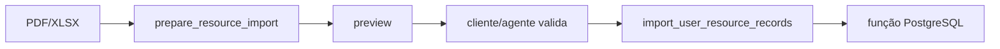

# Midas e Knowledge MCP: referência de contrato

## AI Server

### POST `/v1/chat`

Request:

```json
{
  "user_id": "42",
  "message": "Como está meu consumo de água?",
  "thread_id": "opcional"
}
```

Schema:

| Campo | Regra |
| --- | --- |
| `user_id` | string 1..128 |
| `message` | string 1..8000 |
| `thread_id` | string 1..128; UUID gerado quando omitido |

Response:

```json
{
  "thread_id": "uuid-ou-id",
  "message": "Resposta final",
  "agents": ["sustainability"],
  "tools": ["get_user_context", "get_user_farm_data"]
}
```

`agents` e `tools` dão rastreabilidade funcional ao caminho usado.

### GET `/v1/chat/{thread_id}/history`

Query params:

| Param | Regra |
| --- | --- |
| `user_id` | obrigatório, string 1..128 |
| `limit` | 1..100, default 20 |
| `before` | cursor opcional, 1..32 |

Response:

```json
{
  "thread_id": "thread-1",
  "messages": [
    {"role":"user","content":"..."},
    {"role":"assistant","content":"..."}
  ],
  "next_cursor": null
}
```

Roles permitidas no schema de histórico:

```text
user
assistant
```

Thread ownership é validado no backend.

### GET `/metrics`

Prometheus, autenticado.

### GET `/health`

Liveness do AI Server.

## Knowledge MCP

Transporte:

```text
/mcp/
```

As tools abaixo refletem a assinatura atual de `app/mcp_server.py`.

### `search_knowledge(query, limit)`

Args:

- `query: str`;
- `limit: int`, default `SEARCH_TOP_K`, permitido 1..20.

Uso:

- gera embedding;
- busca Qdrant;
- retorna matches de conhecimento.

### `qdrant_status()`

Sem argumentos.

Diagnóstico da coleção/config Qdrant.

### `postgres_status()`

Sem argumentos.

Diagnóstico da conexão MIDAS read-only.

### `get_user_context(user_type, user_id)`

`user_type`:

```text
farm_owner
company_employee
admin
```

`user_id` precisa ser positivo.

Retorna identidade/contexto e farms autorizadas.

### `get_user_farm_data(user_type, user_id, limit=20)`

`limit`: 1..100.

Retorna grupos bounded de dados como farms, metas, consumos, lotes e dicas conforme o service atual.

### `prepare_resource_import(filename, content_type, encoded_file)`

Assinatura executável atual:

```text
filename: str
content_type: str
encoded_file: str
```

Responsabilidade:

- decodificar arquivo;
- converter PDF/XLSX para representação intermediária;
- extrair preview estruturado via NIM;
- **não gravar no PostgreSQL**.

### `import_user_resource_records(...)`

Assinatura executável atual:

```text
user_type
user_id
request_id
source_type
source_name
records
```

O código atual **não expõe `confirmation` como argumento da tool**, apesar de documentação local histórica descrever confirmação.

A escrita passa por função PostgreSQL controlada.

## Autorização no AI Server

Allowlist observada:

| Agente | Tools |
| --- | --- |
| faq | search_knowledge, get_user_context |
| sustainability | search_knowledge, get_user_context, get_user_farm_data |
| ranking | get_user_context, get_user_farm_data, postgres_status |
| support | search_knowledge, get_user_context |
| fallback | search_knowledge |

Tools de identidade são fechadas pelo backend no fluxo do AI Server.

## Importação segura



`request_id` é UUID no service de banco e serve como base para idempotência/auditoria.

## Regras para clientes/agentes

- não inventar `user_id`;
- não permitir que texto do prompt selecione identidade arbitrária;
- limitar resultados;
- tratar tool error separadamente de resposta vazia;
- não mandar documento/base64 para logs;
- não assumir que MCP health implica Qdrant/Postgres saudáveis;
- usar status tools para diagnóstico.
