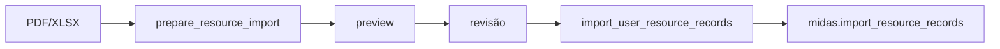

# Midas e Knowledge MCP: referência de contrato

Esta página separa duas interfaces diferentes:

- **AI Server**: API consumida por clientes;
- **Knowledge MCP**: protocolo/tool server consumido por agentes autorizados.

## AI Server

### Rotas

| Método | Rota | Auth |
| --- | --- | --- |
| GET | `/` | obrigatório |
| GET | `/health` | obrigatório |
| GET | `/metrics` | obrigatório |
| POST | `/v1/chat` | obrigatório |
| GET | `/v1/chat/{thread_id}/history` | obrigatório |

!!! note
    O router aplica `get_current_principal` globalmente. Até `/health` exige Bearer no código atual.

### Autenticação

O deployment atual aceita somente access token RS256 emitido pelo Keycloak.

```text
issuer   = https://ouros-keycloak.discloud.app/realms/ouros
audience = ms-ai-server
JWKS     = <issuer>/protocol/openid-connect/certs
```

O AI Server valida assinatura, issuer, audience, timestamps e identidade de negócio. O principal exige `sub`, `database_id`, `account_type` e a realm role correspondente.

Se o payload/query enviar `user_id` por compatibilidade e ele não coincidir com o `database_id` assinado:

- 403.

`AUTH_BEARER_TOKEN`, JWT HS256 local e `AUTH_REQUIRE_USER_JWT` pertencem a versões antigas do contrato e não são modos aceitos pelo deployment atual.

### POST `/v1/chat`

Request:

```json
{
  "message": "Como está meu consumo de energia?",
  "thread_id": "opcional"
}
```

Regras:

| Campo | Regra |
| --- | --- |
| user_id | opcional, 1..128; se enviado, precisa coincidir com o JWT |
| message | 1..8000 |
| thread_id | 1..128; UUID gerado quando omitido |

Response:

```json
{
  "thread_id": "thread-1",
  "message": "Resposta final",
  "agents": ["sustainability"],
  "tools": ["get_user_context", "get_user_farm_data"]
}
```

### Histórico

```http
GET /v1/chat/{thread_id}/history?limit=20&before=<cursor>
```

- `limit`: 1..100;
- `before`: cursor opcional;
- thread precisa pertencer ao usuário.

Response:

```json
{
  "thread_id": "thread-1",
  "messages": [
    {"role":"user","content":"..."},
    {"role":"assistant","content":"..."}
  ],
  "next_cursor": null
}
```

### Status e falhas do AI Server

| Status | Situação típica |
| ---: | --- |
| 200 | chat concluído **ou** input bloqueado pelo guardrail com resposta segura |
| 401 | JWT Keycloak ausente, inválido, expirado ou com issuer/audience incorreto |
| 403 | user_id de compatibilidade não coincide com o JWT; thread pertence a outro usuário |
| 404 | histórico solicitado para thread inexistente |
| 422 | schema inválido ou cursor `before` inválido |
| 503 | budget total do provider/LLM excedeu timeout |

Guardrail bloqueado **não é erro HTTP**. Exemplo de resposta 200:

```json
{
  "thread_id": "thread-1",
  "message": "<mensagem-segura-do-guardrail>",
  "agents": ["guardrail"],
  "tools": []
}
```

Isso permite ao cliente distinguir bloqueio funcional de indisponibilidade técnica.

### Cursor de histórico

`before` é uma posição inteira serializada como string.

Valor não numérico, negativo ou maior que a quantidade de mensagens visíveis retorna 422:

```json
{"detail":"O cursor before e invalido."}
```

## Knowledge MCP

### Transporte

```text
/mcp/
```

Streamable HTTP, stateless.

### Auth real

O Knowledge MCP usa `KeycloakTokenVerifier` e valida o mesmo access token de usuário encaminhado pelo AI Server.

```text
issuer   = https://ouros-keycloak.discloud.app/realms/ouros
audience = ms-mcp-server-ouros-knowledge
JWKS     = <issuer>/protocol/openid-connect/certs
```

```http
Authorization: Bearer <keycloak_access_token>
```

O verifier exige JWT válido e identidade de negócio assinada: `database_id`, `account_type` e a realm role correspondente.

### Tools

| Tool | Parâmetros principais | Função |
| --- | --- | --- |
| `search_knowledge` | query, limit 1..20 | busca Qdrant com embeddings |
| `qdrant_status` | nenhum | diagnóstico Qdrant |
| `postgres_status` | nenhum | diagnóstico PostgreSQL read-only |
| `get_user_context` | user_type, user_id | perfil + farms autorizadas |
| `get_user_farm_data` | user_type, user_id, limit 1..100 | dados bounded por usuário |
| `prepare_resource_import` | filename, content_type, encoded_file | converte/extrai preview, sem write |
| `import_user_resource_records` | identidade, request_id, source, records | write controlado no PostgreSQL |

Tipos de usuário:

```text
farm_owner
company_employee
admin
```

Importação final aceita somente `farm_owner` no código atual.

## Escopo aplicado pelo AI Server

Allowlist atual:

| Agente | Tools |
| --- | --- |
| faq | search_knowledge, get_user_context |
| sustainability | search_knowledge, get_user_context, get_user_farm_data |
| ranking | get_user_context, get_user_farm_data, postgres_status |
| support | search_knowledge, get_user_context |
| fallback | search_knowledge |

Para tools user-scoped, o AI Server vincula o `user_id` no backend e não o entrega livre ao modelo.

## Delegação AI Server → MCP

O AI Server não cria uma segunda credencial para o MCP. Ele encaminha o access token Keycloak já validado na request atual.

Por isso o token mobile contém as duas audiences:

```text
ms-ai-server
ms-mcp-server-ouros-knowledge
```

A primeira autoriza a entrada no AI Server. A segunda permite que o Knowledge MCP valide o mesmo JWT durante o uso de tools.

## Segurança do escopo

Mesmo com autenticação centralizada:

- identidade precisa ter tipo válido;
- `database_id` precisa ser inteiro positivo;
- o AI Server faz binding de identidade;
- tools user-scoped não recebem user ID livre do modelo;
- farm IDs passam por filtros/allowlist;
- write usa função PostgreSQL controlada.

O JWT autentica a identidade, mas ownership e autorização de dados continuam sendo aplicados pela camada de tools/aplicação.

## Importação



`request_id` suporta idempotência/auditoria.

## Erros

FastAPI/MCP e tools podem produzir erros de protocolo/tool. Diferencie:

- falha de autenticação MCP;
- input de tool inválido;
- permission error de identidade/import;
- Qdrant/PostgreSQL indisponíveis;
- resposta vazia legítima.
