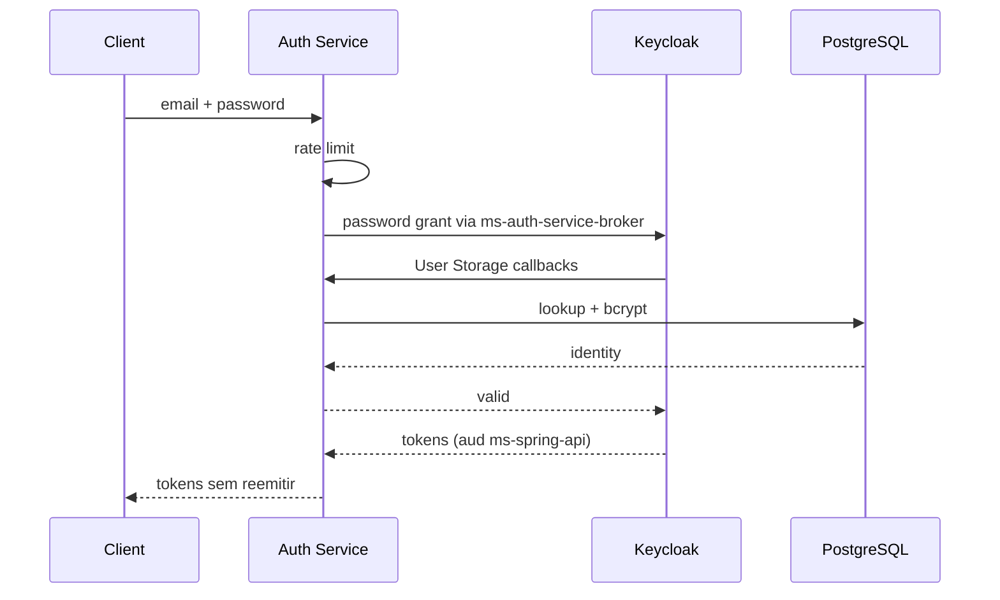

# Auth Service: referência de API

Contrato atual do `ms-auth-service`.

## Papel

O serviço faz a ponte entre credenciais legadas no PostgreSQL e o Keycloak.

Ele:

- verifica bcrypt;
- resolve identidade por email/ID;
- aplica rate limit;
- atende o User Storage do Keycloak;
- funciona como broker first-party de token;
- **não assina o access token final**.

Produção:

```text
https://ms-auth-service.discloud.app
```

## Rotas públicas

| Método | Rota | Auth | Uso |
| --- | --- | --- | --- |
| GET | `/` | nenhuma | metadata mínima |
| GET | `/health` | nenhuma | liveness |
| GET | `/ready` | nenhuma | PostgreSQL + rate limiter |
| POST | `/v1/auth/credentials/verify` | nenhuma | verifica credencial |
| POST | `/v1/auth/token` | nenhuma | login + tokens Keycloak |

As duas rotas de credencial são protegidas por rate limiting.

## `POST /v1/auth/token`

Request:

```json
{
  "email": "usuario@example.com",
  "password": "<senha>"
}
```

Regras:

- email: 3..255, normalizado para lowercase;
- password: 1..128;
- password é `SecretStr` e não deve aparecer em log.

Fluxo:



Response:

```json
{
  "access_token": "<access-token>",
  "expires_in": 300,
  "refresh_expires_in": 1800,
  "refresh_token": "<refresh-token>",
  "token_type": "Bearer",
  "scope": "openid ouros-identity"
}
```

Os TTLs são definidos pelo Keycloak; não hardcode os números do exemplo no cliente.

## `POST /v1/auth/credentials/verify`

Usado quando só é necessário validar a credencial.

```json
{
  "email": "usuario@example.com",
  "password": "<senha>",
  "account_type": "farm_owner"
}
```

`account_type` é opcional:

```text
farm_owner
company_employee
admin
```

Sucesso:

```json
{
  "authenticated": true,
  "identity": {
    "id": 42,
    "email": "usuario@example.com",
    "account_type": "farm_owner",
    "realm_role": "farm_owner",
    "name": "Nome",
    "farm_id": 7,
    "enterprise_id": null,
    "first_access": false
  }
}
```

Sem `account_type`, o serviço procura candidatos compatíveis; identidade ambígua pode resultar em 409.

## Readiness

`/health` verifica processo.

`/ready` só retorna ready quando:

- PostgreSQL responde;
- rate limiter/Redis responde no modo configurado.

Falha: 503.

## Rate limit

Defaults observados:

```text
IP burst:                 3 / 10 s
IP:                       5 / min
IP:                      20 / 15 min
email:                    5 / 15 min
```

Ao exceder:

```http
HTTP/1.1 429 Too Many Requests
Retry-After: <segundos>
```

O cliente deve respeitar `Retry-After`.

## API interna do User Storage

Prefixo:

```text
/internal/v1
```

Essas rotas:

- não aparecem no OpenAPI público;
- exigem JWT de serviço Keycloak;
- validam issuer/audience/client;
- são destinadas ao `keycloak-user-storage`.

### Rotas

| Método | Rota | Uso |
| --- | --- | --- |
| GET | `/internal/v1/identities/by-email?email=...` | lookup por email |
| GET | `/internal/v1/identities/{account_type}/{database_id}` | resolve federated ID |
| POST | `/internal/v1/credentials/verify` | valida password do usuário |

Sem identidade: 404.

Credencial humana inválida na rota interna: **403**. O 401 fica reservado para falha do service token.

## JWT de serviço

Contrato esperado:

- issuer Keycloak;
- audience `ms-auth-service-internal`;
- client autorizado `keycloak-user-storage`.

Não reutilize token de usuário para chamar a API interna.

## Status relevantes

| Status | Significado |
| ---: | --- |
| 200 | operação válida |
| 401 | login público inválido ou service token inválido |
| 403 | password humano inválido na rota interna |
| 404 | identidade interna não encontrada |
| 409 | lookup público ambíguo |
| 422 | shape/email/password inválidos |
| 429 | rate limit |
| 503 | dependência/broker indisponível |

## Uso recomendado

- login de cliente first-party: `/v1/auth/token`;
- não use `credentials/verify` como “sessão”;
- não chame `/internal/v1` fora do fluxo Keycloak;
- nunca persista password;
- proteja refresh token como credencial.
