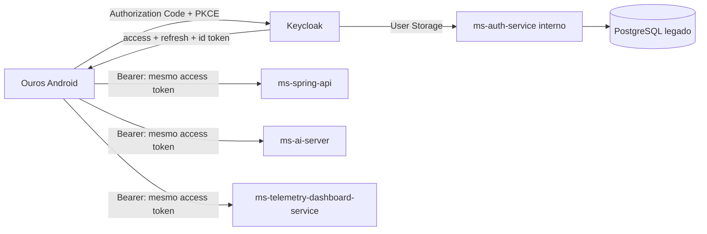

# Autenticação e identidade

## Estado atual

Keycloak é o issuer central de identidade do Ouros. O aplicativo Android usa um client público próprio, `ouros-mobile`, com Authorization Code + PKCE S256 e Browser Flow.



O PostgreSQL continua armazenando identidades e hashes legados. O User Storage do Keycloak consulta o `ms-auth-service` por uma rota interna autenticada.

## Login mobile

Contrato:

```text
client_id:    ouros-mobile
redirect_uri: com.ourosapp.ourosandroidapp:/oauth2redirect
flow:         Authorization Code + PKCE S256
scopes:       openid ouros-identity
client secret: nenhum
```

Quando o OTP por e-mail está habilitado, senha + OTP fazem parte do mesmo Browser Flow. Depois de concluído o login, o app não repete autenticação para cada microserviço.

O access token do mobile carrega:

```text
aud:
  - ms-spring-api
  - ms-ai-server
  - ms-telemetry-dashboard-service
```

O refresh token conversa somente com o Keycloak.

Veja o tutorial de implementação: [Autenticação no Android](../guides/mobile-authentication.md).

## Resource servers

| Serviço | Audience exigida | Observação |
| --- | --- | --- |
| `ms-spring-api` | `ms-spring-api` | JWT via Spring Security/JWKS |
| `ms-ai-server` | `ms-ai-server` | JWT RS256 via JWKS |
| `ms-telemetry-dashboard-service` | `ms-telemetry-dashboard-service` | JWT RS256 via JWKS; rotas atuais ainda exigem role `admin` |

Cada serviço valida a própria audience. Um token multi-audience continua passando pela validação porque contém a audience específica de cada resource server.

## Responsabilidades

### Keycloak

- Browser Flow;
- OTP por e-mail quando habilitado;
- Authorization Code + PKCE;
- access/refresh/id tokens;
- roles;
- audiences;
- OIDC discovery;
- JWKS;
- clients e scopes.

### Auth Service

- lookup de identidade legado;
- validação de senha do banco legado;
- User Storage bridge;
- rotas internas usadas pelo Keycloak;
- broker legado enquanto existir compatibilidade.

O Auth Service não assina o JWT final.

### Aplicativo mobile

- inicia o Browser Flow;
- mantém `state`/PKCE através da biblioteca OIDC;
- armazena tokens com proteção do Android;
- envia o access token como Bearer;
- faz refresh silencioso;
- não possui client secret.

## Claims principais

| Claim | Significado |
| --- | --- |
| `sub` | ID Keycloak |
| `database_id` | ID local no banco legado |
| `account_type` | tipo da conta |
| `farm_id` | vínculo de fazenda |
| `enterprise_id` | vínculo de empresa |
| `first_access` | estado de primeiro acesso |
| `realm_access.roles` | roles do realm |
| `aud` | resource servers que podem aceitar o token |

Não trate `sub` e `database_id` como equivalentes.

## Service-to-service

O User Storage chama o Auth Service com service JWT próprio:

```text
client: keycloak-user-storage
aud:    ms-auth-service-internal
```

Esse token representa uma aplicação, não um usuário.

## Clients internos e legado

`ms-ai-server-debug` é uma exceção interna com Direct Access Grant para o console de debug. Não pertence ao mobile.

`ms-auth-service-broker` continua existindo para compatibilidade first-party/legada enquanto o rollout é concluído. O Android novo não deve usá-lo.

## OIDC

Issuer:

```text
https://ouros-keycloak.discloud.app/realms/ouros
```

Discovery:

```text
https://ouros-keycloak.discloud.app/realms/ouros/.well-known/openid-configuration
```

JWKS:

```text
https://ouros-keycloak.discloud.app/realms/ouros/protocol/openid-connect/certs
```
