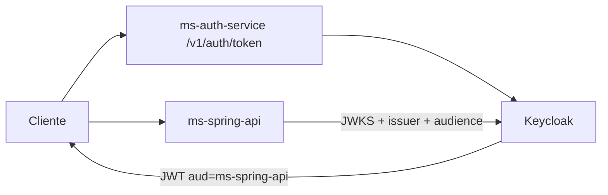
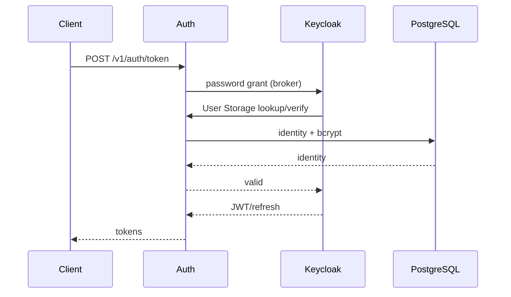

# Autenticação e identidade

## Estado atual

Keycloak já é o issuer central para o fluxo de domínio:



O PostgreSQL continua armazenando identidades/hashes legados, acessados pelo User Storage através do Auth Service.

## Responsabilidades

### Keycloak

- access/refresh tokens;
- roles;
- audiences;
- OIDC discovery;
- JWKS;
- clients/service accounts.

### Auth Service

- lookup legado;
- bcrypt;
- rate limit;
- User Storage bridge;
- broker de login first-party.

Não assina o JWT final.

### Spring API

Já é OAuth2 Resource Server.

Valida:

- JWKS;
- issuer;
- timestamps;
- `aud=ms-spring-api`;
- role reconhecida.

Não possui mais endpoints locais de login na `main` atual.

## Login first-party



O broker solicita `openid ouros-identity` e possui audience `ms-spring-api`.

## Claims principais

| Claim | Significado |
| --- | --- |
| `sub` | ID Keycloak |
| `database_id` | ID local no banco legado |
| `account_type` | tipo da conta |
| `farm_id` | vínculo de fazenda |
| `enterprise_id` | vínculo de empresa |
| `first_access` | estado de primeiro acesso |
| `realm_access.roles` | roles do realm |
| `resource_access` | roles por client |
| `aud` | resource server destinatário |

Não trate `sub` e `database_id` como equivalentes.

## Roles aceitas pelo Spring

Mapeamento:

```text
ADMIN / ADM → ADM
COMPANY_EMPLOYEE → COMPANY_EMPLOYEE
FARM_OWNER → FARM_OWNER
```

O Spring aceita role de realm, resource client ou claim simples `role`.

## Service-to-service

O User Storage chama Auth interno com service JWT.

Contrato:

- audience `ms-auth-service-internal`;
- client `keycloak-user-storage`.

Senha de usuário nunca deve ser reutilizada como credencial de serviço.

## Outros mecanismos ainda existentes

A migração de identidade não está uniforme em todo o ecossistema:

- Telemetry: Bearer estático;
- Knowledge MCP: Bearer estático;
- AI Server: Bearer compartilhado ou JWT HS256 local.

Esses mecanismos são contratos atuais, mas não devem ser copiados como padrão de novos resource servers.

## Browser/mobile

O IaC suporta:

- web: Authorization Code + PKCE;
- mobile: Authorization Code + PKCE.

No snapshot atual, clients web/mobile ativos ainda não aparecem em `iac/resources/`; existem exemplos/suporte no reconciliador.

## OIDC

Issuer produção:

```text
https://ouros-keycloak.discloud.app/realms/ouros
```

Discovery:

```text
https://ouros-keycloak.discloud.app/realms/ouros/.well-known/openid-configuration
```

JWKS:

```text
https://ouros-keycloak.discloud.app/realms/ouros/protocol/openid-connect/certs
```
