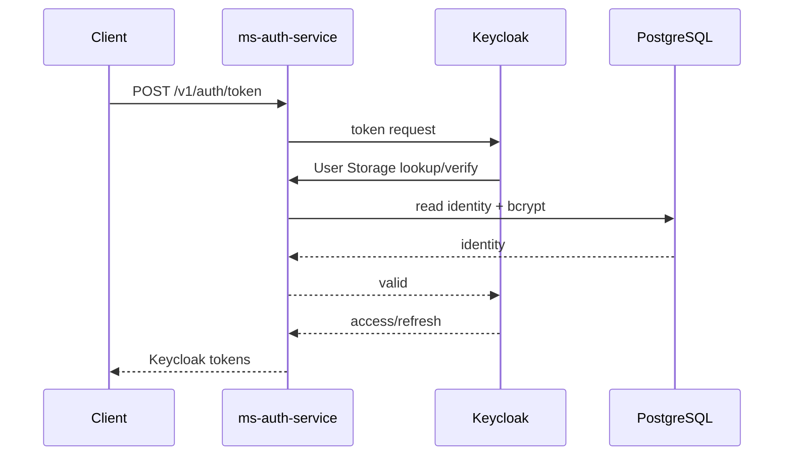

# Autenticação e identidade

A autenticação do Ouros está migrando de JWTs emitidos por serviços individuais para uma autoridade central baseada em Keycloak.

## Componentes

### Keycloak

Responsável por:

- sessão;
- access token;
- refresh token;
- roles;
- audiences;
- OIDC discovery;
- JWKS.

### Auth Service

Responsável por:

- lookup da identidade legada;
- validação bcrypt;
- rate limiting;
- bridge de User Storage;
- broker first-party de token.

Ele não assina o JWT novo.

### Banco legado

Ainda armazena:

- identidades;
- hashes de senha;
- IDs de negócio.

## Fluxo first-party via broker



## Fluxo browser/mobile OIDC

A infraestrutura Keycloak suporta clients:

- `mobile`: Authorization Code + PKCE S256;
- `web`: Authorization Code + PKCE S256;
- `service`: Client Credentials;
- `microservice`: resource server/audience.

## Claims

Não misture os conceitos:

| Claim | Significado |
| --- | --- |
| `sub` | sujeito de autenticação do Keycloak |
| `database_id` | ID da linha legada |
| `account_type` | tipo de conta |
| `farm_id` | vínculo de fazenda, quando aplicável |
| `enterprise_id` | vínculo empresarial |
| `realm_access.roles` | autorização por role |
| `aud` | resource server(s) destino |

## Validação em APIs

Resource server deve validar:

1. algoritmo/assinatura;
2. JWKS;
3. `iss`;
4. `exp`;
5. `aud`;
6. roles/claims exigidos para a ação.

**Decodificar JWT não é validar JWT.**

## Service-to-service

Use Client Credentials para identidade de máquina.

Não reutilize senha de usuário para integração backend.

Exemplo: Keycloak User Storage chama o Auth Service com service JWT cujo:

- issuer é conhecido;
- audience é `ms-auth-service-internal`;
- `azp` é o client esperado.

## Spring API legado

O `ms-spring-api` ainda possui logins:

- `/adms/login`;
- `/company-employees/login`;
- `/farm-owners/login`.

Eles pertencem ao caminho legado durante a migração. Novos serviços não devem copiá-los como padrão arquitetural.

## Frontend web

O frontend atual ainda usa login demo. Para implementação real:

- preferir BFF/cookie HttpOnly quando essa arquitetura for adotada;
- ou fluxo OIDC seguro;
- não guardar refresh token em localStorage;
- não considerar `PrivateRoute` autorização.

## Android

Tokens precisam ficar em armazenamento seguro da plataforma, por exemplo mecanismos apoiados no Android Keystore.

## Logout/revogação

O modelo completo deve considerar:

- sessão Keycloak;
- refresh token;
- access token curto;
- revogação/expiração.

Não basta apagar um objeto JavaScript ou fechar Activity.

## Endpoints OIDC

Issuer:

```text
https://ouros-keycloak.discloud.app/realms/ouros
```

Discovery:

```text
https://ouros-keycloak.discloud.app/realms/ouros/.well-known/openid-configuration
```

JWKS:

```text
https://ouros-keycloak.discloud.app/realms/ouros/protocol/openid-connect/certs
```
