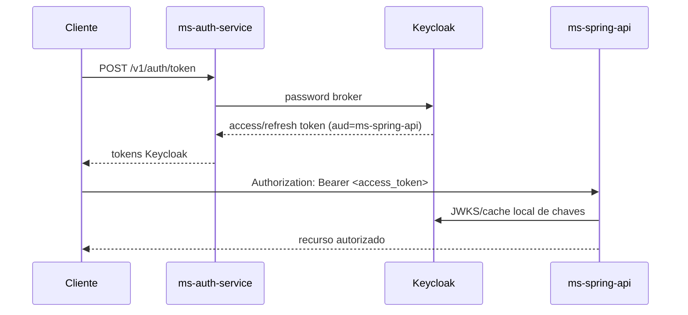

# APIs do Ouros

Esta seção é a referência de integração entre clientes e serviços. O objetivo é responder quatro perguntas sem exigir leitura do código:

1. **qual serviço chamar**;
2. **como autenticar**;
3. **qual contrato enviar/receber**;
4. **quais erros e regras de autorização esperar**.

## Estado atual

| Serviço | Interface | Responsabilidade | Autenticação atual |
| --- | --- | --- | --- |
| `ms-spring-api` | REST/OpenAPI | domínio transacional | **JWT Keycloak** com issuer + JWKS + audience `ms-spring-api` |
| `ms-auth-service` | REST | login, credenciais e bridge de identidade | rotas públicas + JWT de serviço nas rotas internas |
| `ouros-keycloak` | OIDC/OAuth2 | tokens, roles, audiences e federação | protocolos Keycloak |
| `ms-ai-server` | REST | chat Midas e histórico | Bearer compartilhado **ou** JWT HS256 configurável |
| Knowledge MCP | MCP Streamable HTTP | conhecimento, contexto e importação | Bearer estático compartilhado |
| Telemetry | REST | dashboards Databricks e renderização | Bearer estático em rotas de negócio |
| GitHub Manager | REST + UI | criação/padronização de repos | cookie de sessão assinado |
| Auto Review | webhook HTTP | revisão automática de PRs | assinatura HMAC do GitHub |

!!! important "Spring já migrou para Keycloak"
    O `ms-spring-api` atual não possui mais endpoints de login local. Ele é um OAuth2 Resource Server e valida tokens Keycloak por JWKS, issuer e audience.

## Fluxo principal de login + domínio



O client `ms-auth-service-broker` está configurado no IaC com `AUDIENCES="ms-spring-api"`, então o fluxo first-party já foi preparado para produzir token aceito pelo Spring.

## Qual interface usar?

### Login de usuário

```http
POST /v1/auth/token
```

Use o **Auth Service**. Ele aplica rate limit e devolve tokens emitidos pelo Keycloak.

### CRUD de fazenda, empresa, lotes, água, energia e perfis

Use o **Spring API**.

### Chat Midas

```http
POST /v1/chat
```

Use o **AI Server**. Clientes comuns não devem reproduzir o roteamento de tools MCP diretamente.

### Conhecimento e dados para agentes

Use o **Knowledge MCP** por um consumidor MCP autorizado, normalmente o AI Server.

### Dashboard Databricks

Use o **Telemetry Dashboard Service**.

### Criar/configurar repositório da org

Use o **GitHub Manager**. É uma API interna privilegiada, protegida por sessão.

### Auto review

O **Auto Review** não é uma API de cliente convencional. Ele recebe webhooks do GitHub em `POST /webhooks/github`.

## Fonte de verdade dos contratos

| Tipo | Fonte preferida |
| --- | --- |
| shape HTTP exato | OpenAPI/Swagger da versão implantada |
| autorização/ownership | service layer + esta documentação |
| OIDC/JWT | IaC do `ouros-keycloak` |
| tools MCP | `app/mcp_server.py` + referência Midas/MCP |
| mudanças de banco | repos de database/migrations |

A wiki explica contexto e integração. Quando OpenAPI e texto divergirem, confira o commit/deploy e corrija a documentação.

## Convenções importantes

Não existe um único formato universal de erro entre todos os serviços:

- Spring usa `ProblemDetail`;
- FastAPI normalmente usa `{"detail": ...}`;
- validação Pydantic usa 422;
- Auth rate limit usa 429 + `Retry-After`.

Veja [Convenções de API](conventions.md).

## Referências

- [Spring API](spring-api-reference.md)
- [Auth Service](auth-service-reference.md)
- [Midas e MCP](ai-mcp-reference.md)
- [Telemetry](telemetry-reference.md)
- [Keycloak clients e audiences](keycloak-clients.md)
- [Autenticação e identidade](authentication.md)
- [Exemplos executáveis](examples.md)
