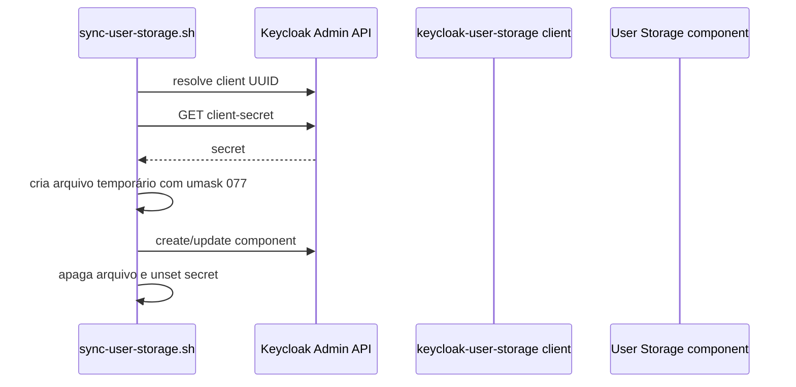

# Keycloak: clients, audiences e User Storage

Referência do IaC atual em `ouros-keycloak/iac`.

## Tipos de client suportados

O reconciliador reconhece cinco tipos:

| Tipo | Uso | Característica |
| --- | --- | --- |
| `mobile` | app nativo | public client + Authorization Code + PKCE S256 |
| `web` | SPA/web | public client + Authorization Code + PKCE S256 |
| `service` | machine-to-machine | confidential + service account |
| `microservice` | resource server | audience/scope para API |
| `password-broker` | bridge first-party do Auth Service | confidential + direct access grant controlado |

Implicit Flow fica desabilitado no reconciliador.

## Resources realmente versionados hoje

Em `iac/resources/`:

```text
keycloak-user-storage.conf
ms-auth-service-broker.conf
ms-auth-service-internal.conf
ms-telemetry-dashboard-service.conf
```

Não existem hoje, nessa pasta, clients reais `ouros-mobile` ou `ouros-web`; eles aparecem apenas como exemplos em `iac/examples/`.

Isso é importante para não confundir “tipo suportado pelo IaC” com “client já provisionado”.

## `keycloak-user-storage`

Config:

```text
CLIENT_TYPE=service
CLIENT_ID=keycloak-user-storage
AUDIENCES=ms-auth-service-internal
```

Papel:

- identidade machine-to-machine do provider User Storage;
- obtém token via Client Credentials;
- chama as rotas internas do Auth Service;
- access token inclui audience `ms-auth-service-internal`.

O secret é gerado pelo Keycloak e injetado no componente User Storage pelo reconciliador.

## `ms-auth-service-broker`

Config:

```text
CLIENT_TYPE=password-broker
CLIENT_ID=ms-auth-service-broker
AUDIENCES=
```

Papel:

- usado somente pelo `ms-auth-service`;
- recebe credenciais first-party;
- pede token ao Keycloak;
- secret fica no secret management do Auth Service.

Este client existe para o fluxo de migração/bridge. Não é um client que browser/mobile devam conhecer diretamente.

## `ms-auth-service-internal`

Config:

```text
CLIENT_TYPE=microservice
CLIENT_ID=ms-auth-service-internal
AUDIENCE=ms-auth-service-internal
SCOPE_NAME=ms-auth-service-internal-audience
MAPPER_NAME=ms-auth-service-internal-audience
```

É o resource server lógico das rotas internas do Auth Service.

O audience mapper adiciona:

```text
aud = ms-auth-service-internal
```

ao access token quando o scope correspondente é anexado.

## `ms-telemetry-dashboard-service`

Config atual:

```text
CLIENT_TYPE=microservice
CLIENT_ID=ms-telemetry-dashboard-service
AUDIENCE=ms-telemetry-dashboard-service
SCOPE_NAME=ms-telemetry-dashboard-audience
MAPPER_NAME=ms-telemetry-dashboard-audience
```

Isso prepara o Keycloak para emitir tokens destinados ao Telemetry.

!!! note "Migração ainda incompleta"
    O Telemetry atual ainda autentica rotas de negócio por Bearer estático. O resource server já existe no IaC, mas o serviço ainda não valida JWT/audience Keycloak no código analisado.

## Exemplos suportados pelo IaC

### Mobile

Exemplo versionado:

```text
CLIENT_TYPE=mobile
CLIENT_ID=ouros-mobile
REDIRECT_URIS=com.ouros.app:/oauth2redirect
AUDIENCES=ms-example-api
```

Características:

- public client;
- sem client secret;
- Authorization Code;
- PKCE S256;
- redirect URI custom scheme.

### Web

Exemplo:

```text
CLIENT_TYPE=web
CLIENT_ID=ouros-web
REDIRECT_URIS=https://app.example.com/*
WEB_ORIGINS=https://app.example.com
AUDIENCES=ms-example-api
```

Características:

- public client;
- PKCE S256;
- redirect URIs e origins explícitos.

### Service

Exemplo:

```text
CLIENT_TYPE=service
CLIENT_ID=ouros-worker
AUDIENCES=ms-example-api
```

Uso:

- Client Credentials;
- service account;
- secret gerado no Keycloak.

### Microservice

Exemplo:

```text
CLIENT_TYPE=microservice
CLIENT_ID=ms-example-api
AUDIENCE=ms-example-api
SCOPE_NAME=ms-example-api-audience
MAPPER_NAME=ms-example-api-audience
```

Não é login interativo. É o recurso que deve aparecer em `aud`.

## Audience scopes

O reconciliador cria client scope e mapper do tipo:

```text
oidc-audience-mapper
```

Configuração observada:

- inclui audience no access token;
- não inclui no ID token;
- inclui em introspection;
- mantém mapper idempotente por nome.

## Identity scope

O reconciliador mantém o client scope:

```text
ouros-identity
```

Ele cria mappers de atributos de usuário para claims do domínio.

Claims documentados pelo projeto:

- `database_id`;
- `account_type`;
- `farm_id`;
- `enterprise_id`;
- `first_access`.

Esses claims vão no access token e podem aparecer em userinfo/introspection conforme o mapper.

## User Storage

Config real:

```text
NAME=ouros-auth-service
PROVIDER_ID=ouros-auth-service
AUTH_SERVICE_URL=https://ms-auth-service.discloud.app
SERVICE_CLIENT_ID=keycloak-user-storage
TOKEN_URL=http://127.0.0.1:8080/realms/ouros/protocol/openid-connect/token
PRIORITY=0
CACHE_POLICY=NO_CACHE
```

### Por que TOKEN_URL é localhost?

O reconciliador roda dentro do container do Keycloak e pede o service token diretamente ao próprio Keycloak em:

```text
127.0.0.1:8080
```

Isso evita depender da rota pública para uma chamada interna do mesmo processo/runtime.

### Cache

```text
NO_CACHE
```

O provider consulta a fonte federada em vez de manter uma cópia duradoura da identidade legada no Keycloak.

### Import

```text
importEnabled=false
```

O usuário permanece federado. Keycloak não importa silenciosamente a identidade para virar owner das credenciais.

## Como o secret do User Storage chega ao provider



O script:

- cria arquivo temporário sob `/tmp/keycloak-iac`;
- usa `umask 077`;
- remove o arquivo no cleanup;
- faz `unset` do secret após reconciliação.

O secret não pertence ao Git.

## Ordem de reconciliação

O `sync-clients.sh` faz duas passadas:

1. cria todos os `microservice` e seus audience scopes;
2. reconcilia mobile/web/service/password-broker.

Motivo:

> aplicações podem referenciar audiences sem depender da ordem alfabética dos arquivos.

## Adicionando uma nova API

Exemplo:

```text
CLIENT_TYPE=microservice
CLIENT_ID=ms-nova-api
AUDIENCE=ms-nova-api
SCOPE_NAME=ms-nova-api-audience
MAPPER_NAME=ms-nova-api-audience
```

Depois:

1. valide com `bash iac/validate.sh`;
2. adicione a audience aos clients que precisam chamar a API;
3. faça deploy/reconciliação;
4. configure a API para validar issuer + audience;
5. teste token certo e token de audience errada.

## Adicionando mobile/web de verdade

Não copie o exemplo sem trocar:

- client ID;
- redirect URI;
- web origin;
- audiences.

Para web:

- HTTPS em produção;
- origins exatas;
- nada de client secret no browser.

Para mobile:

- PKCE;
- redirect URI controlado pelo app;
- armazenamento seguro dos tokens.

## Falhas comuns

### Token válido, API retorna 401

Compare:

```text
iss
aud
exp
assinatura
```

### Client existe, audience não aparece

Cheque:

- scope criado;
- mapper criado;
- scope anexado ao client consumidor.

### User Storage não encontra usuários

Cheque:

- Auth Service;
- service client;
- client secret;
- token URL local;
- audience interna;
- provider Java;
- PostgreSQL legado.

### Alterei um .conf e nada mudou

O reconciliador só roda no startup/deploy correspondente. Verifique logs `[keycloak-iac]`.

## Semântica de remoção

A reconciliação é deliberadamente não destrutiva.

Remover um `.conf` do Git não significa automaticamente apagar o client do Keycloak.

Exclusão precisa ser uma operação administrativa explícita.
