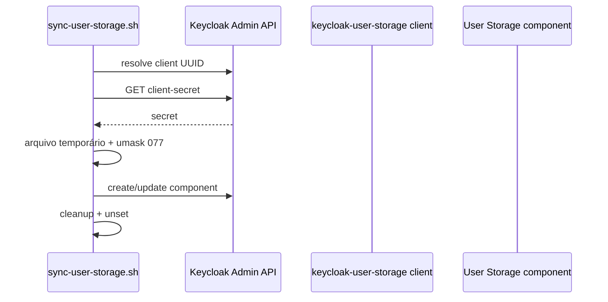

# Keycloak: clients, audiences e User Storage

Referência do IaC atual em `ouros-keycloak/iac`.

## Tipos de client suportados

O reconciliador reconhece seis tipos:

| Tipo | Uso | Característica |
| --- | --- | --- |
| `mobile` | app nativo | public client + Authorization Code + PKCE S256 |
| `web` | SPA/web | public client + Authorization Code + PKCE S256 |
| `service` | machine-to-machine | confidential + service account |
| `microservice` | resource server | audience/scope para API |
| `password-broker` | bridge first-party do Auth Service | confidential + direct access grant controlado |
| `password-grant` | ferramenta interna isolada | confidential + Direct Access Grant restrito |

Implicit Flow fica desabilitado.

## Resources mobile e de identidade

O client mobile de produção é versionado em:

```text
iac/resources/ouros-mobile.conf
```

As três APIs chamadas diretamente pelo Android são:

```text
ms-spring-api
ms-ai-server
ms-telemetry-dashboard-service
```

Essa lista é apenas a superfície mobile-facing. A configuração completa do client também inclui `ms-ai-server-mcp-exchange`, que torna o JWT elegível para uma troca autenticada pelo backend. O token mobile não contém a audience do Knowledge MCP.

O IaC também mantém os clients internos, resource servers e exceções de debug necessários para o ecossistema.

## Matriz atual

| Client | Tipo | Audience(s) | Uso |
| --- | --- | --- | --- |
| `ouros-mobile` | mobile | `ms-spring-api`, `ms-ai-server`, `ms-telemetry-dashboard-service`, `ms-ai-server-mcp-exchange` | login Android + elegibilidade para exchange backend-only |
| `keycloak-user-storage` | service | `ms-auth-service-internal` | chama Auth interno |
| `ms-auth-service-broker` | password-broker | conjunto first-party legado | broker de compatibilidade |
| `ms-ai-server-debug` | password-grant | `ms-ai-server`, `ms-ai-server-mcp-exchange` | console de debug interno; MCP continua passando por exchange |
| `ms-auth-service-internal` | microservice | `ms-auth-service-internal` | resource server do Auth interno |
| `ms-spring-api` | microservice | `ms-spring-api` | resource server de domínio |
| `ms-ai-server` | microservice | `ms-ai-server` | resource server do Midas |
| `ms-telemetry-dashboard-service` | microservice | `ms-telemetry-dashboard-service` | resource server de dashboards |

## `keycloak-user-storage`

Config:

```text
CLIENT_TYPE=service
CLIENT_ID=keycloak-user-storage
AUDIENCES=ms-auth-service-internal
```

Papel:

- identidade machine-to-machine do provider User Storage;
- obtém token via Client Credentials;
- chama `/internal/v1/**` no Auth Service;
- access token inclui audience `ms-auth-service-internal`.

O secret é gerado pelo Keycloak e injetado no componente User Storage pelo reconciliador.

## `ms-auth-service-broker`

Config atual:

```text
CLIENT_TYPE=password-broker
CLIENT_ID=ms-auth-service-broker
AUDIENCES=ms-spring-api|ms-telemetry-dashboard-service|ms-ai-server|ms-ai-server-mcp-exchange|ms-mcp-server-ouros-knowledge-codemode
```

Papel:

- usado somente pelo `ms-auth-service`;
- recebe credenciais first-party;
- pede token ao Keycloak;
- produz access token com audience aceita pelo Spring;
- secret fica no secret management do Auth Service.

Fluxo:

```text
POST /v1/auth/token
      ↓
ms-auth-service-broker
      ↓
Keycloak
      ↓
aud=ms-spring-api
      ↓
ms-spring-api
```

Browser/mobile não devem conhecer o client secret desse broker.

## `ms-auth-service-internal`

Config:

```text
CLIENT_TYPE=microservice
CLIENT_ID=ms-auth-service-internal
AUDIENCE=ms-auth-service-internal
SCOPE_NAME=ms-auth-service-internal-audience
MAPPER_NAME=ms-auth-service-internal-audience
```

É o resource server lógico das rotas internas do Auth Service.

O audience mapper adiciona:

```text
aud = ms-auth-service-internal
```

ao access token dos consumidores aos quais o scope foi anexado.

## `ms-spring-api`

Config:

```text
CLIENT_TYPE=microservice
CLIENT_ID=ms-spring-api
AUDIENCE=ms-spring-api
SCOPE_NAME=ms-spring-api-audience
MAPPER_NAME=ms-spring-api-audience
```

O Spring atual valida:

- assinatura JWKS;
- issuer;
- timestamps;
- `aud=ms-spring-api`.

O código usa `AudienceValidator` além dos validators padrão do Spring Security.

## `ms-telemetry-dashboard-service`

Config:

```text
CLIENT_TYPE=microservice
CLIENT_ID=ms-telemetry-dashboard-service
AUDIENCE=ms-telemetry-dashboard-service
SCOPE_NAME=ms-telemetry-dashboard-audience
MAPPER_NAME=ms-telemetry-dashboard-audience
```

O Telemetry já valida JWT Keycloak por JWKS, issuer e audience. As rotas atuais de dashboard também exigem a realm role `admin`, portanto audience válida não substitui autorização de negócio.

## Exemplos suportados pelo IaC

### Token exchange AI → Knowledge MCP

```bash
CLIENT_TYPE=token-exchange
CLIENT_ID=ms-ai-server-mcp-exchange
AUDIENCE=ms-ai-server-mcp-exchange
AUDIENCES=ms-mcp-server-ouros-knowledge
```

Esse client é **confidencial**, não possui login interativo e não fica no APK. O AI Server autentica no token endpoint com o client secret e executa Standard Token Exchange v2. O `subject_token` precisa conter `aud=ms-ai-server-mcp-exchange`; o token resultante contém `aud=ms-mcp-server-ouros-knowledge` e `azp=ms-ai-server-mcp-exchange`.

### Mobile de produção

```text
CLIENT_TYPE=mobile
CLIENT_ID=ouros-mobile
REDIRECT_URIS=com.ourosapp.ourosandroidapp:/oauth2redirect|http://127.0.0.1:8765/callback
AUDIENCES=ms-spring-api|ms-ai-server|ms-telemetry-dashboard-service|ms-ai-server-mcp-exchange
```

Características:

- public client;
- sem client secret;
- Authorization Code;
- PKCE S256 obrigatório;
- Browser Flow com OTP por e-mail quando habilitado;
- um access token para as três APIs mobile-facing e com audience do requester confidencial de token exchange;
- redirect Android controlado pelo app;
- redirect loopback exato reservado ao smoke test operacional.

### Web

```text
CLIENT_TYPE=web
CLIENT_ID=ouros-web
REDIRECT_URIS=https://app.example.com/*
WEB_ORIGINS=https://app.example.com
AUDIENCES=ms-example-api
```

Características:

- public client;
- PKCE S256;
- redirect URIs e origins explícitos.

### Service

```text
CLIENT_TYPE=service
CLIENT_ID=ouros-worker
AUDIENCES=ms-example-api
```

Uso:

- Client Credentials;
- service account;
- secret gerado no Keycloak.

### Microservice

```text
CLIENT_TYPE=microservice
CLIENT_ID=ms-example-api
AUDIENCE=ms-example-api
SCOPE_NAME=ms-example-api-audience
MAPPER_NAME=ms-example-api-audience
```

Não é login interativo. Representa o recurso que deve aparecer em `aud`.

## Audience scopes

O reconciliador cria client scope e mapper do tipo:

```text
oidc-audience-mapper
```

Comportamento observado:

- inclui audience no access token;
- não inclui no ID token;
- inclui em introspection;
- mantém mapper idempotente por nome.

## `ouros-identity`

O reconciliador mantém o client scope:

```text
ouros-identity
```

Claims de domínio:

- `database_id`;
- `account_type`;
- `farm_id`;
- `enterprise_id`;
- `first_access`.

`database_id` é especialmente importante para o Spring, porque pode evitar lookup local por email na conversão do principal.

Claims ajudam no contexto, mas não substituem authorization/ownership de negócio.

## User Storage

Config observada:

```text
NAME=ouros-auth-service
PROVIDER_ID=ouros-auth-service
AUTH_SERVICE_URL=https://ms-auth-service.discloud.app
SERVICE_CLIENT_ID=keycloak-user-storage
TOKEN_URL=http://127.0.0.1:8080/realms/ouros/protocol/openid-connect/token
PRIORITY=0
CACHE_POLICY=NO_CACHE
```

### Por que `TOKEN_URL` usa localhost?

O reconciliador/provider roda junto do Keycloak e pede o service token diretamente ao runtime local:

```text
127.0.0.1:8080
```

Isso evita uma ida pela rota pública para falar com o próprio Keycloak.

### Cache

```text
NO_CACHE
```

O provider consulta a fonte federada em vez de manter cópia duradoura da identidade legada.

### Importação de usuário

O fluxo federado é read-only. O hash legado continua no PostgreSQL e a validação de password é delegada ao Auth Service.

## Como o secret chega ao provider



O secret não pertence ao Git.

## Ordem de reconciliação

`sync-clients.sh` usa duas passadas:

1. cria `microservice` e seus audience scopes;
2. cria scopes de requester para clients `token-exchange`;
3. reconcilia mobile/web/service/token-exchange/password-broker.

Motivo:

> consumidores podem referenciar audiences sem depender da ordem alfabética dos arquivos.

## Adicionar nova API

Exemplo:

```text
CLIENT_TYPE=microservice
CLIENT_ID=ms-nova-api
AUDIENCE=ms-nova-api
SCOPE_NAME=ms-nova-api-audience
MAPPER_NAME=ms-nova-api-audience
```

Depois:

1. rode `bash iac/validate.sh`;
2. adicione a audience aos clients consumidores;
3. faça deploy/reconciliação;
4. configure issuer + JWKS + audience na API;
5. teste token certo, expirado e audience errada;
6. teste roles/ownership.

Veja [Guia: nova API com Keycloak](../guides/new-keycloak-api.md).

## Contrato mobile real

O client `ouros-mobile` já é parte da configuração gerenciada. Alterações de redirect URI ou audiences devem passar por PR no `ouros-keycloak`; não devem ser feitas manualmente pelo desenvolvedor Android.

Para implementação do app, use [Autenticação no Android](../guides/mobile-authentication.md).

Web continua seguindo o mesmo princípio de public client + PKCE, mas possui configuração própria quando for ativado.

## Falhas comuns

### Token válido, API retorna 401

Compare:

```text
iss
aud
exp
assinatura
```

No Spring, confirme também role reconhecida.

### Client existe, audience não aparece

Cheque:

- scope criado;
- mapper criado;
- scope anexado ao client consumidor;
- token foi reemitido depois da mudança.

### User Storage não encontra usuário

Cheque:

- Auth Service;
- service client;
- client secret;
- token URL local;
- audience interna;
- provider Java;
- PostgreSQL legado.

### Alterei um `.conf` e nada mudou

O reconciliador roda no startup/deploy correspondente. Veja logs `[keycloak-iac]`.

## Semântica de remoção

A reconciliação é deliberadamente não destrutiva.

Remover um `.conf` do Git não significa apagar automaticamente o client no Keycloak.

Exclusão exige operação administrativa explícita.
