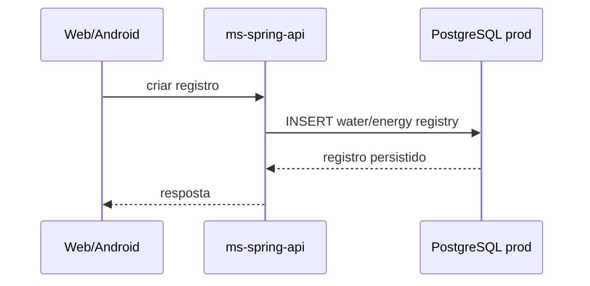
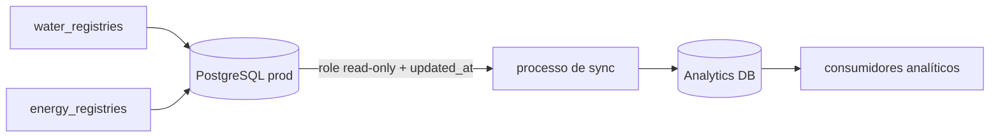
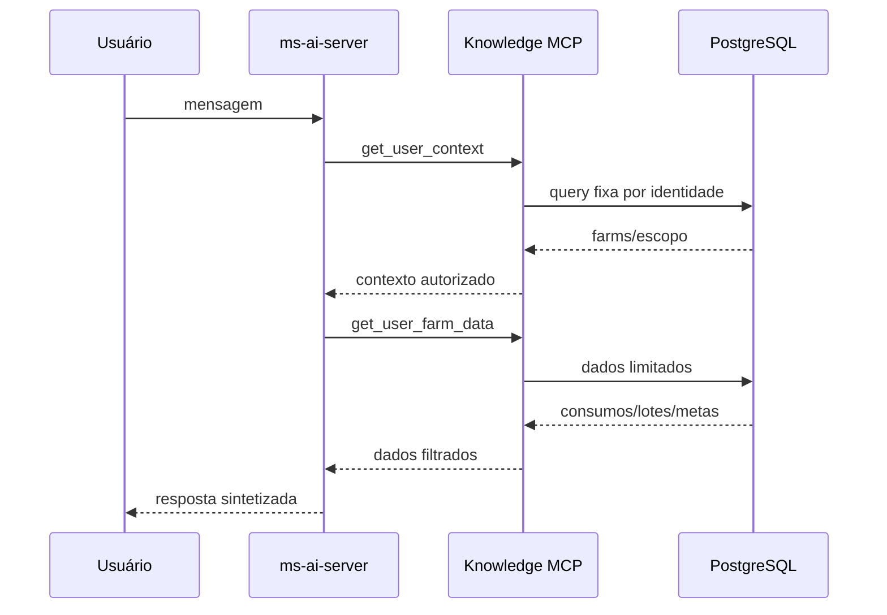
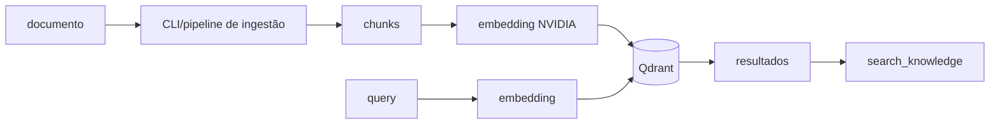
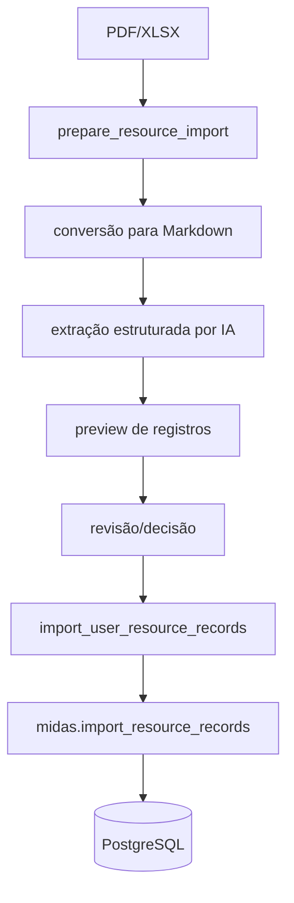
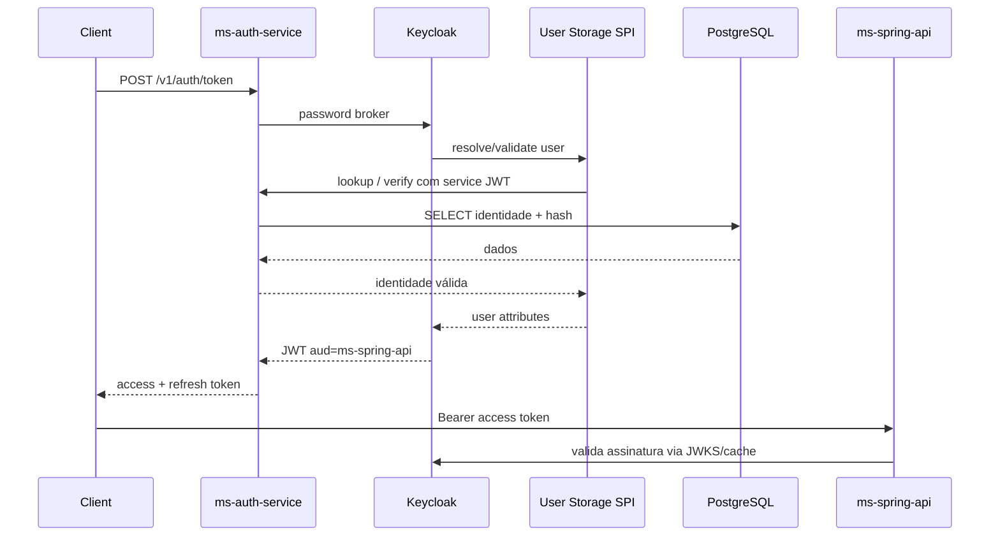
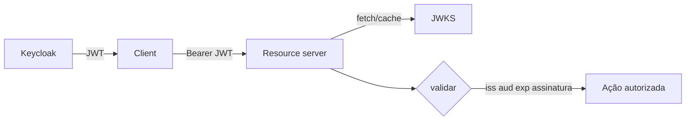
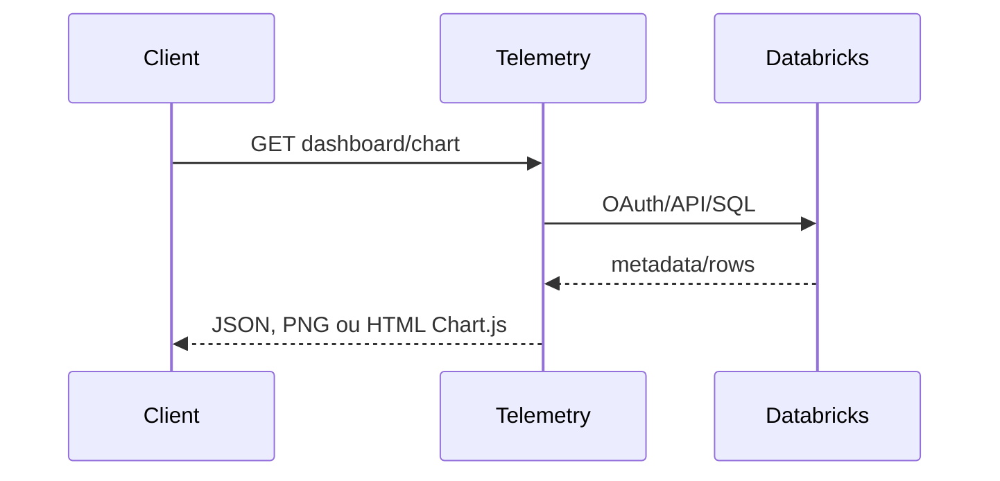

# Fluxos e linhagem de dados

## Registro de água e energia

Fluxo transacional esperado:



Tabelas principais:

- `water_registries`;
- `energy_registries`.

O PostgreSQL é a fonte de verdade.

## Consumo → analytics

O banco de produção já inclui objetos para sincronização analítica.



No snapshot atual, o repo de analytics ainda não materializa o modelo final.

Portanto, a seta `Analytics DB → dashboards` é arquitetura de destino, não garantia de implementação já concluída.

## Dados do usuário → Midas



Pontos de segurança:

- `user_id` é injetado pelo backend;
- `farm_id` é validado contra farms autorizadas;
- o LLM não recebe SQL arbitrário.

## Documento → conhecimento vetorial



Compatibilidade crítica:

> o modelo de embedding usado para consultar precisa ser compatível com o usado na indexação.

Trocar o modelo pode exigir reindexar a coleção.

## PDF/XLSX → importação de consumo



Separação importante:

- preview não escreve;
- escrita passa por função controlada;
- `request_id` suporta idempotência;
- conexão de importação é separada da conexão read-only.

## Identidade legada → Keycloak → Spring



O password hash não migra automaticamente para o banco interno do Keycloak.

## JWT → resource server



A autorização de negócio continua dependendo de roles/ownership, não apenas de token válido.

## Thread do Midas → MongoDB

```mermaid
flowchart LR
    CHAT[/v1/chat] --> OWNER[thread_owners]
    CHAT --> CP[checkpoints]
    CHAT --> CW[checkpoint_writes]
    CHAT --> MEM[user_memories]
```

Cada estrutura tem índice próprio versionado no repo Mongo.

## Databricks → gráfico



O serviço aplica cache curto para gráficos e normaliza falhas externas em 502/504.

## Produção → QA

Somente contrato gerenciado:

```text
prod main
  ↓
sync de sql/config/runner
  ↓
upstream.lock
  ↓
QA reconciler
```

Não há replicação de dados de produção como parte desse fluxo.

## Linhagem e privacidade

Ao criar um novo dado, documente:

1. origem;
2. fonte de verdade;
3. onde é replicado;
4. quem pode ler;
5. quem pode escrever;
6. retenção;
7. anonimização;
8. índices;
9. consumidor final;
10. como apagar/corrigir quando necessário.
