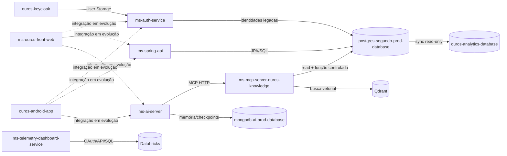

# Dependências entre repositórios

Esta página mostra **quem depende de quem** e qual contrato conecta os componentes.

## Mapa executável atual



Linhas pontilhadas representam integração de produto esperada ou em evolução, não necessariamente um cliente funcional já implementado no snapshot analisado.

## Matriz de contratos

| Produtor | Consumidor | Contrato |
| --- | --- | --- |
| Keycloak | clientes e APIs | OIDC/JWT/JWKS |
| Auth Service | Keycloak User Storage | REST interno + service JWT |
| PostgreSQL prod | Auth Service | tabelas de identidade, read-only |
| PostgreSQL prod | Spring API | schema transacional |
| PostgreSQL prod | Knowledge MCP | queries fixas + função de importação |
| PostgreSQL prod | Analytics | leitura incremental limitada |
| Knowledge MCP | AI Server | MCP Streamable HTTP |
| MongoDB AI | AI Server | memória, thread ownership e checkpoints |
| Qdrant | Knowledge MCP | coleção vetorial + embeddings compatíveis |
| Databricks | Telemetry | APIs + SQL/dashboard metadata |
| Templates | GitHub Manager | scaffolds e convenções |
| GitHub API | GitHub Manager | criação/configuração de repos |
| GitHub API | Auto Review | PRs, checks, reviews e comments |
| Groq/NIM | AI Server / Auto Review | APIs OpenAI-compatible ou provider-specific wrapper |

## Dependências por serviço

### Spring API

Depende diretamente de:

- PostgreSQL;
- PostgreSQL;
- Keycloak/JWKS para validação de JWT;
- Auth Service como upstream do fluxo first-party de login;
- configuração/secrets em runtime.

Não depende do AI Server para CRUD básico.

### Auth Service

Depende de:

- PostgreSQL de identidades;
- Redis quando configurado;
- Keycloak para o broker de token;
- JWKS/issuer Keycloak para rotas internas.

### Keycloak

Depende de:

- PostgreSQL próprio do Keycloak;
- Auth Service para federação das identidades legadas;
- provider Java compilado;
- IaC de realm/clients/scopes.

### AI Server

Depende de:

- MongoDB;
- Knowledge MCP;
- Groq e/ou NVIDIA conforme perfil;
- auth configurada;
- Infisical/runtime para secrets.

Pode subir com providers de IA indisponíveis em alguns cenários, mas degrada para respostas default/fallback.

### Knowledge MCP

Depende de:

- Qdrant;
- NVIDIA embeddings;
- PostgreSQL MIDAS read-only;
- conexão separada de importação quando a tool de importação é usada.

### Telemetry

Depende de:

- Databricks workspace;
- credenciais OAuth;
- SQL Warehouse/recursos acessíveis;
- Bearer de API atual.

## Dependências de dados

### Produção → QA

`postgres-segundo-qa-database` deriva o contrato gerenciado de:

```text
postgres-segundo-prod-database/main
```

via workflow de sincronização e `upstream.lock`.

QA não é réplica de dados.

### Produção → Analytics

O prod fornece objetos de sincronização e role read-only.

O analytics é projeção derivada. Não é fonte de verdade.

### AI Server → MongoDB schema repo

O código do AI Server consome coleções/índices versionados em:

- `mongodb-ai-prod-database`;
- `mongodb-ai-qa-database`.

Se o código passar a depender de índice novo, a migration deve entrar no repo de banco correspondente.

## Dependências de automação

### GitHub Manager → templates

Mudança em template pode afetar **novos** repos.

Mudança no GitHub Manager pode afetar:

- branch protection;
- workflows;
- labels;
- secrets;
- estrutura inicial.

Essas alterações têm blast radius organizacional.

### Auto Review → checks externos

O Auto Review interpreta:

- combined statuses;
- check runs;
- reviews;
- CodeRabbit;
- Sonar quando presente;
- resultado de IA.

Renomear checks ou mudar política de CI pode alterar o comportamento do bot sem mudar o bot.

## Acoplamentos que merecem atenção

### 1. IDs de identidade

Há dois mundos coexistindo:

- `sub` Keycloak;
- `database_id` legado.

Nunca substitua um pelo outro sem migration e contrato explícitos.

### 2. Modelos de embedding

Ingestão e busca Qdrant precisam usar embeddings compatíveis. Mudar modelo pode exigir reindexação.

### 3. Schema PostgreSQL

Spring/Auth/MCP podem quebrar simultaneamente se uma migration remover/renomear campo usado por mais de um consumidor.

### 4. Claims JWT

Adicionar claim costuma ser compatível. Renomear/remover claim pode quebrar múltiplos resource servers/clientes.

### 5. Índices Mongo

Mudança de unicidade pode falhar por dados históricos já incompatíveis.

## Como revisar uma mudança transversal

Pergunte:

1. quem produz esse dado/contrato?
2. quem o consome hoje?
3. quem pode consumir por configuração, mesmo sem import explícito?
4. há QA separado?
5. precisa migration?
6. precisa rollout compatível em duas etapas?
7. precisa atualizar docs/client?
8. rollback é possível depois que dados forem transformados?
