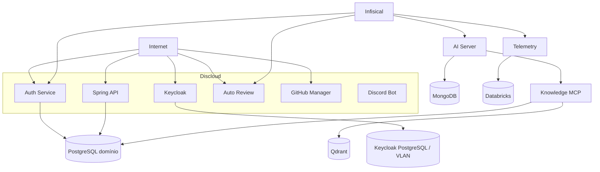
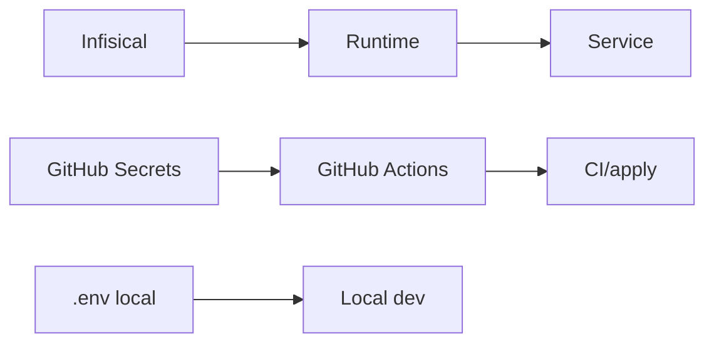

# Topologia de deploy

Mapa do que é conhecido sobre runtime/deploy. Não assume infraestrutura que não aparece nos repositórios.

## Visão simplificada



Nem todos os nós acima têm host público confirmado no Git. O diagrama mostra responsabilidades e dependências, não DNS completo.

## Serviços com Discloud config observado

### Spring API

```text
TYPE=site
ID=ms-spring-api
MAIN=app.jar
START=java -jar app.jar --server.port=8080
RAM=512
AUTORESTART=true
```

### Keycloak

```text
ID=ouros-keycloak
TYPE=site
MAIN=Dockerfile
RAM=2048
AUTORESTART=true
```

### Auto Review

```text
ID=ouros-autoreview
TYPE=site
MAIN=src/server.ts
RAM=512
VERSION=22
```

### GitHub Manager

```text
TYPE=site
ID=proxy-ouros
MAIN=main.py
START=uvicorn main:app --host 0.0.0.0 --port 8080
RAM=512
```

### Discord Bot

```text
TYPE=bot
MAIN=run.py
NAME=ouros-bot
RAM=200
AUTORESTART=true
VLAN=true
```

## Keycloak e VLAN

O repo documenta PostgreSQL dedicado do Keycloak em VLAN privada.

Connection URL observada no exemplo:

```text
jdbc:postgresql://keycloak-db:5432/keycloak
```

Isso indica resolução interna do DB pelo ambiente de deploy.

## Containers

Dockerfiles observados em:

- Spring API;
- Keycloak;
- Auth Service;
- AI Server;
- Knowledge MCP;
- Telemetry;
- GitHub Manager;
- Auto Review;
- frontend web;
- templates relacionados.

Docker não implica que todos os ambientes usem exatamente a mesma forma de deploy.

## GitHub Pages

`ouros-docs` não roda como serviço Discloud.

Fluxo:

```text
main
 ↓
GitHub Actions
 ↓
mkdocs build
 ↓
Pages artifact
 ↓
GitHub Pages
```

## Bancos

Repos de banco não hospedam o servidor.

Eles gerenciam:

- schema;
- migrations;
- apply;
- versionamento.

A infraestrutura física/managed database é externa ao repo.

## QA PostgreSQL

O QA tem pipeline próprio de sync/reconciliação.

A topologia lógica é:

```text
prod repo/main
   ↓ GitHub sync
qa repo
   ↓ reconciler
PostgreSQL QA
```

## Analytics

O banco analítico é separado do transacional.

A sincronização deve partir de role read-only no prod.

## Fluxo de secrets



Não copiar secrets de produção para `.env` só para reproduzir localmente.

## Endpoints públicos confirmados

### Keycloak

```text
https://ouros-keycloak.discloud.app
```

### Auth Service

```text
https://ms-auth-service.discloud.app
```

### AI Server

Referenciado em documentação/config de métricas como:

```text
ms-ai-server.discloud.app
```

### Knowledge MCP

Exemplo público usado pelo próprio repo:

```text
https://ms-midas-mcp.discloud.app/mcp/
```

Para outros serviços, não invente hostname pela convenção do nome.

## Portas

Porta interna recorrente:

```text
8000
```

Exceções/runtime:

- Spring Discloud inicia em 8080;
- GitHub Manager Discloud inicia em 8080;
- Keycloak usa 8080 internamente.

## Health checks

Um load balancer/deploy deve preferir:

- liveness para reinício;
- readiness para receber tráfego.

Serviços sem readiness separado merecem cuidado com dependências externas lentas durante startup.

## Falha de zona/provedor

Como vários serviços estão na mesma plataforma de hosting, outage de provedor pode virar falha correlacionada.

Não interprete múltiplos 5xx simultâneos automaticamente como regressões independentes.

## Antes de mover serviço

Documente:

1. DNS;
2. porta;
3. TLS;
4. env/secrets;
5. network access;
6. banco;
7. CORS;
8. issuer/audience;
9. health/readiness;
10. rollback.
