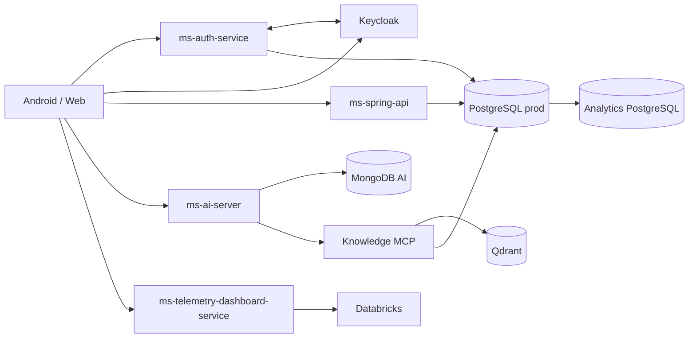
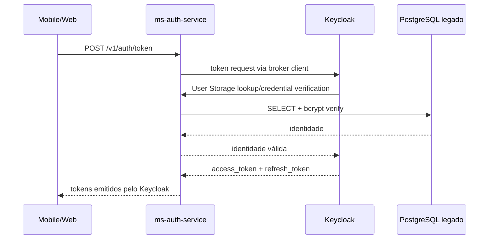

# Arquitetura do Ouros

Esta página descreve a arquitetura **observada nos repositórios da organização Ouros-App em 18/09/2026**. Ela diferencia o que já existe no código do que ainda é intenção de produto.

!!! important "Fonte de verdade"
    Para comportamento executável, o código do serviço e os arquivos de infraestrutura têm prioridade sobre READMEs antigos. Alguns repositórios ainda possuem documentação local desatualizada.

## Visão geral



## Camadas

| Camada | Repositórios principais | Responsabilidade atual |
| --- | --- | --- |
| Identidade | `ouros-keycloak`, `ms-auth-service` | Sessões, tokens, federação das identidades legadas e verificação de credenciais. |
| API de domínio | `ms-spring-api` | CRUD e regras de domínio para fazendas, lotes, usuários, empresas e consumo. |
| IA | `ms-ai-server` | Orquestra agentes, memória, guardrails e tools MCP. |
| Conhecimento | `ms-mcp-server-ouros-knowledge` | Busca semântica, contexto MIDAS e importação controlada. |
| Telemetria | `ms-telemetry-dashboard-service` | Lê dashboards Databricks e renderiza gráficos. |
| Dados transacionais | `postgres-segundo-prod-database` | Fonte de verdade do schema e dos dados operacionais. |
| QA | `postgres-segundo-qa-database` | Espelho reconciliado do contrato de produção, preservando dados de teste. |
| Persistência de IA | `mongodb-ai-prod-database`, `mongodb-ai-qa-database` | Índices para memória, ownership de threads e checkpoints LangGraph. |
| Analytics | `ouros-analytics-database` | Banco analítico versionado; estrutura de transformação ainda inicial. |
| Clientes | `ms-ouros-front-web`, `ouros-android-app` | Clientes web/mobile; ambos ainda estão próximos dos templates-base. |
| Automação | `ms-github-manager`, `ouros-autoreview-app` | Criação de repos e automação de revisão/aprovação. |

## Identidade e autenticação

A arquitetura de identidade está em transição do login direto das APIs para Keycloak.



O `ms-auth-service` **não assina JWTs**. O Keycloak é o emissor dos novos tokens. O serviço de autenticação permanece dono da leitura das credenciais legadas.

Claims relevantes emitidos pelo escopo `ouros-identity`:

- `database_id`: ID numérico legado;
- `account_type`: `farm_owner`, `company_employee` ou `admin`;
- `farm_id` / `enterprise_id`: vínculos de negócio, quando existentes;
- `first_access`: estado legado de primeiro acesso;
- `realm_access.roles`: roles de autorização;
- `sub`: identificador estável do sujeito no Keycloak.

## Dados

O PostgreSQL de produção é a fonte de verdade para o domínio transacional. O QA sincroniza o contrato de schema de produção, mas é propositalmente mutável. O reconciliador de QA faz dry-run transacional e pode colocar uma migration não crítica em quarentena sem bloquear migrations independentes.

O MongoDB da IA é separado do banco transacional. Ele armazena estruturas de memória e estado do grafo, não o domínio principal do Ouros.

## IA e MCP

O `ms-ai-server` usa LangGraph e separa roteamento, especialistas e síntese final. O fluxo atual é:

```text
guardrail
   ↓
router
   ↓
faq / sustainability / ranking / support / fallback
   ↓
fan-in
   ↓
default
   ↓
guardrail de saída
```

Especialistas podem usar memória e um subconjunto de tools MCP. O agente `default` recebe apenas resultados estruturados e é o único responsável pela resposta final em linguagem natural.

## Observabilidade

Há abordagens diferentes por serviço:

- `ms-ai-server`: métricas Prometheus autenticadas;
- `ms-telemetry-dashboard-service`: métricas Prometheus e logs JSON;
- `ms-github-manager`: métricas Prometheus protegidas por token;
- Keycloak: saúde e comportamento observados pelos fluxos de integração/CI;
- bancos: rastreabilidade por tabelas/coleções de controle de scripts e versões.

## Deploy

Vários serviços são preparados para Discloud, normalmente usando Docker/Discloud config e secrets injetados em runtime. Serviços mais novos também integram Infisical via Universal Auth.

Regra operacional:

1. nunca versionar credenciais reais;
2. usar `.env.example` apenas como contrato;
3. manter secrets no ambiente/Infisical;
4. validar deploy e migrations via CI;
5. tratar produção como fonte de verdade para schema gerenciado.
