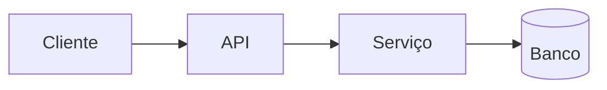

# Arquitetura

Esta seção é a fonte central para entender a arquitetura do Ouros.

## Conteúdo sugerido

- mapa dos microserviços;
- responsabilidade de cada serviço;
- dependências entre serviços;
- fluxo de autenticação;
- fluxo de dados;
- integrações externas;
- diagramas de sequência e arquitetura.

## Diagramas

Mermaid já está habilitado no portal:

