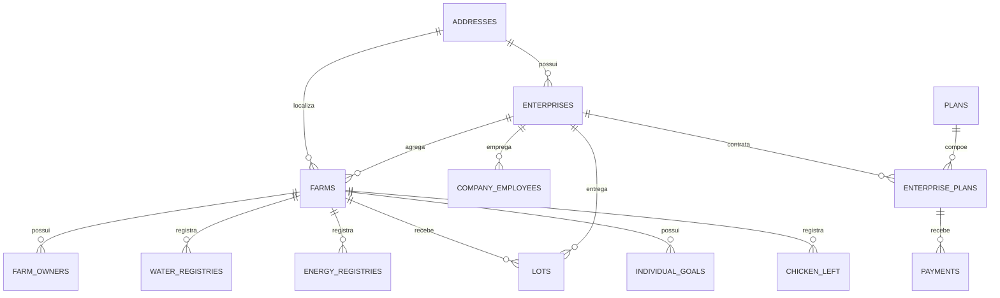

# Modelo de domínio PostgreSQL

Esta página resume `sql/banco_ouros_fisico.sql` de `postgres-segundo-prod-database`.

## Diagrama simplificado

O diagrama omite algumas tabelas de associação e log para preservar legibilidade.

## Identidade e organização

### `addresses`

Endereço normalizado usado por empresas e fazendas.

Campos principais:

- `id`;
- `zip_code`;
- `state`;
- `city`;
- `number`;
- `country`.

### `enterprises`

Empresa integradora.

Campos principais:

- identidade e contato;
- `document_number`;
- `id_address`.

### `farms`

Unidade produtiva central do domínio.

Campos relevantes:

- `name`;
- `area_property`;
- `region`;
- `poultry_capacity`;
- `chickens_now`;
- `foto_url`;
- `id_address`;
- `id_enterprise`.

### `farm_owners`

Usuário produtor associado a uma fazenda.

Inclui:

- dados pessoais;
- hash de `password`;
- `first_access`;
- `id_farm`.

### `company_employees`

Usuário de empresa associado a `enterprises`.

### `adms`

Identidade administrativa legada mínima, com email e hash de senha.

!!! note "Keycloak"
    Esses IDs continuam relevantes como IDs de negócio. O `sub` do Keycloak é identidade de autenticação e não substitui automaticamente `database_id`.

## Produção e lotes

### `lots`

Registra lotes entregues à fazenda:

- recebidos;
- entregues;
- perdas;
- custo;
- data de entrega;
- empresa;
- fazenda.

Há constraint impedindo `delivered_chickens > received_chickens`.

### `chicken_left`

Registra saída de aves por fazenda e data.

## Consumo ambiental

### `water_registries`

Leituras de hidrômetro:

- `registration_date`;
- `start_hydrometer`;
- `end_hydrometer`;
- `id_farm`.

Constraint: leitura final não pode ser menor que a inicial.

### `energy_registries`

Consumo de energia:

- data;
- valor de consumo;
- fazenda.

Essas tabelas são centrais para analytics e funcionalidades de sustentabilidade.

## Metas e conteúdo

O schema inclui:

- `individual_goals`;
- `state_goals`;
- `regions_goals`;
- `farm_goals`;
- `tips`;
- `categories`;
- `tip_categories`;
- `farms_tips`;
- `reviews`.

Há tabelas de associação explícitas para relacionamentos muitos-para-muitos.

## Planos e pagamentos

### `plans`

Plano comercial com título, duração, descrição e preço.

### `enterprise_plans`

Relaciona empresa e plano.

### `payments`

Pagamento vinculado à empresa e ao vínculo `enterprise_plan`.

A FK composta garante que o plano empresarial usado no pagamento pertença à mesma empresa.

## Logs

O schema mantém tabelas de log como:

- `payments_log`;
- `lots_log`;
- `farms_log`.

O repo também contém `triggers_logs.sql`, responsável por comportamento de auditoria complementar.

## Objetos adicionais por migrations

Nem todo contrato do banco está no arquivo físico principal. Outros SQLs adicionam recursos, roles, views e funções, incluindo:

- `views_galinhas_consumo.sql`;
- `keycloak_user_link.sql`;
- `ms_auth_service.sql`;
- `midas-user.sql`;
- `midas-resource-import.sql`;
- `analytics_sync_user.sql`;
- `atualiza_updated_at_analytics.sql`.

Portanto, ao analisar o estado final do banco, considere toda a `execution_order`, não apenas `banco_ouros_fisico.sql`.

## Alterando o schema

1. evite modificar dados de usuário dentro de um script `on_change`;
2. use migration `once` para transformação imutável;
3. prefira DDL idempotente em arquivos reexecutáveis;
4. atualize `config.yaml`;
5. rode os testes;
6. valide em QA;
7. documente impacto em APIs e analytics.
