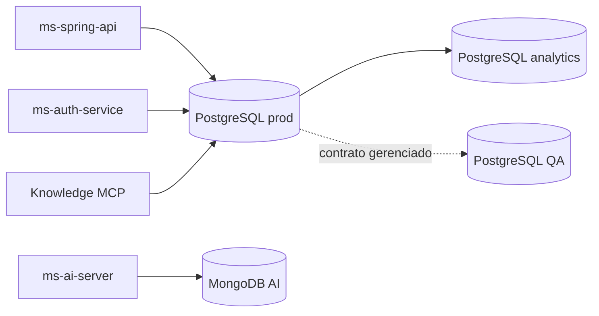

# Bancos de dados

O Ouros separa persistência por responsabilidade. O banco transacional, o estado da IA e a camada analítica não são intercambiáveis.

## Mapa

## Repositórios

| Banco | Repo | Papel |
| --- | --- | --- |
| PostgreSQL produção | `postgres-segundo-prod-database` | Fonte de verdade do schema transacional e migrations. |
| PostgreSQL QA | `postgres-segundo-qa-database` | Ambiente mutável de teste reconciliado com o contrato de produção. |
| PostgreSQL analytics | `ouros-analytics-database` | Destino analítico versionado; ainda em bootstrap no estado atual. |
| MongoDB AI prod | `mongodb-ai-prod-database` | Memória e estado persistente do Midas. |
| MongoDB AI QA | `mongodb-ai-qa-database` | Mesmo contrato estrutural em QA. |

## Regra de ownership

!!! important
    Mudanças de schema pertencem ao repositório do banco correspondente. APIs não devem depender de Hibernate/JPA ou ODM para criar estruturas automaticamente em produção.

No PostgreSQL principal, o Spring usa `ddl-auto=none`. Isso evita que uma mudança acidental de entidade vire uma migration implícita.

## Versionamento PostgreSQL

O executor Python suporta quatro modos:

| Modo | Comportamento |
| --- | --- |
| `once` | Executa no máximo uma vez. Adequado para migrations imutáveis. |
| `on_change` | Reexecuta quando o checksum do arquivo muda. Deve ser idempotente. |
| `always` | Executa em toda aplicação. Exige atenção especial a idempotência. |
| `never` | Mantém um script no histórico/repo sem execução automática. |

As execuções são rastreadas por `controle_scripts_sql` e `controle_versoes`.

## Versionamento MongoDB

O executor Mongo segue os mesmos modos conceituais. Entradas são transacionais por padrão; quando uma operação precisa ser não transacional, o contrato exige `idempotent: true`.

Coleções de controle:

- `controle_scripts_mongo`;
- `controle_contadores`;
- `controle_versoes`.

## QA não é clone descartável

O QA PostgreSQL preserva dados e drift de teste por design. Produção é autoridade para objetos gerenciados, mas o reconciliador não tenta transformar QA numa cópia byte a byte.

Veja [PostgreSQL QA](../repositories/data/postgres-segundo-qa-database.md).

## Schema transacional

Veja [Modelo de domínio PostgreSQL](domain-schema.md) para as entidades e relacionamentos principais.
