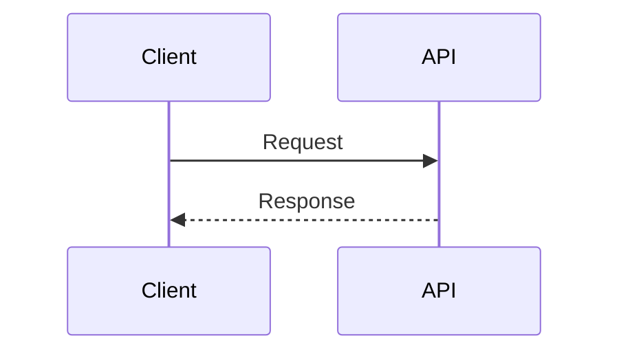

# Escrevendo documentação

Depois do bootstrap inicial, escrever documentação deve ser a parte simples.

## Criar uma página

Crie um arquivo Markdown dentro de `docs/`:

```text
docs/apis/minha-api.md
```

Depois adicione a página ao `nav` de `mkdocs.yml`:

```yaml
nav:
  - APIs:
      - Visão geral: apis/index.md
      - Minha API: apis/minha-api.md
```

## Preview local

```bash
python -m venv .venv
source .venv/bin/activate
python -m pip install -r requirements.txt
mkdocs serve
```

Abra `http://127.0.0.1:8000`.

## Validar antes do push

```bash
mkdocs build --strict
```

O mesmo comando roda no CI.

## Convenções

- escreva em PT-BR, exceto nomes técnicos que façam mais sentido em inglês;
- prefira exemplos executáveis a explicações abstratas;
- não duplique documentação que já é gerada automaticamente pelo Swagger/OpenAPI;
- use caminhos e nomes reais dos serviços;
- nunca coloque secrets;
- mantenha diagramas próximos do texto que eles explicam;
- atualize a documentação na mesma PR que altera um comportamento documentado.

## Blocos úteis

### Avisos

```md
!!! warning
    Texto do aviso.
```

### Código

Use blocos com a linguagem informada.

### Diagramas

Mermaid funciona sem configuração adicional:


