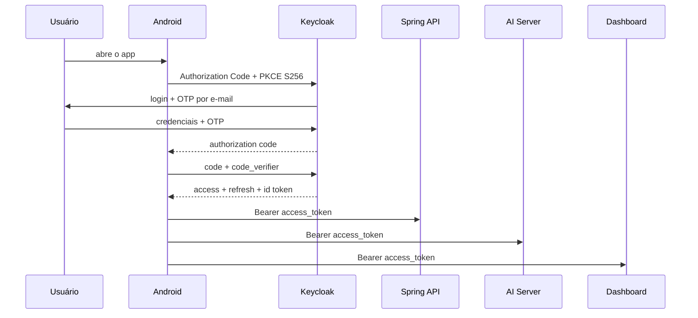

# Integração de autenticação no Android

Este é o contrato de autenticação que o aplicativo Ouros deve consumir. A infraestrutura, o client OIDC e as audiences ficam sob responsabilidade do backend/Keycloak. O app não precisa criar clients, configurar IaC ou conhecer secrets de servidor.

## Contrato pronto

| Item | Valor |
| --- | --- |
| Issuer | `https://ouros-keycloak.discloud.app/realms/ouros` |
| Discovery | `https://ouros-keycloak.discloud.app/realms/ouros/.well-known/openid-configuration` |
| Client ID | `ouros-mobile` |
| Tipo | public client |
| Fluxo | Authorization Code + PKCE S256 |
| Redirect Android | `com.ourosapp.ourosandroidapp:/oauth2redirect` |
| Scopes | `openid ouros-identity` |
| Client secret | **não existe no app** |

O login interativo usa o Browser Flow do Keycloak. Quando o OTP por e-mail está habilitado em produção, a sequência é senha + código recebido por e-mail. O app não implementa uma tela própria para enviar senha ao endpoint de token.

## Uma autenticação para as três APIs

O `ouros-mobile` recebe um único access token com as audiences:

```text
ms-spring-api
ms-ai-server
ms-telemetry-dashboard-service
```

O mesmo access token é enviado como Bearer às três APIs:

```http
Authorization: Bearer <access_token>
```

Não faça um novo login para abrir o Midas nem para abrir o Dashboard.

O refresh token é diferente: ele só deve ser enviado ao endpoint de token do Keycloak. Nunca envie refresh token para Spring, AI Server ou Telemetry.

## Fluxo esperado no app



Em uma abertura futura do app, se houver refresh token válido, faça refresh silencioso. Só volte ao login interativo quando a sessão não puder mais ser renovada.

## O que implementar no Android

A implementação deve usar uma biblioteca OIDC/OAuth2 para Android que suporte Authorization Code + PKCE e Custom Tabs, como AppAuth for Android. Não implemente OAuth manualmente com WebView.

A camada de autenticação deve expor algo equivalente a:

```kotlin
interface AuthSession {
    suspend fun login(): SessionTokens
    suspend fun accessToken(): String
    suspend fun refresh(): SessionTokens
    suspend fun logout()
}
```

O restante do app não deve conhecer PKCE, authorization code ou refresh grant. Ele só pede um access token válido.

### Configuração

Use discovery OIDC sempre que a biblioteca suportar:

```text
https://ouros-keycloak.discloud.app/realms/ouros/.well-known/openid-configuration
```

Configuração estática equivalente:

```text
client_id     = ouros-mobile
redirect_uri  = com.ourosapp.ourosandroidapp:/oauth2redirect
scope         = openid ouros-identity
response_type = code
PKCE          = S256
```

Não adicione `client_secret`. O client mobile é público.

### Redirect URI

O app deve registrar o custom scheme:

```text
com.ourosapp.ourosandroidapp:/oauth2redirect
```

O callback deve voltar para a Activity responsável por concluir a autorização OIDC.

O redirect `http://127.0.0.1:8765/callback` também existe no client, mas é reservado ao smoke test operacional do backend. O Android não deve usá-lo.

## Armazenamento de sessão

Persistir tokens somente em armazenamento protegido pelo Android Keystore ou solução equivalente.

Regras:

- access token pode ficar em memória e no armazenamento seguro se necessário;
- refresh token deve ficar apenas em armazenamento seguro;
- não salvar tokens em SharedPreferences comum;
- não escrever access/refresh/id token em logs;
- não enviar tokens para analytics/crash reporting;
- não incluir tokens em URL;
- limpar sessão local no logout definitivo.

## Renovação silenciosa

Antes de uma chamada autenticada:

1. se o access token ainda estiver válido, use-o;
2. se estiver expirado ou perto de expirar, use o refresh token;
3. atualize access e refresh tokens com a resposta do Keycloak;
4. execute a chamada original.

Se uma API responder `401`:

1. tente refresh uma única vez;
2. repita a request uma única vez com o novo access token;
3. se o refresh falhar com sessão inválida/expirada, limpe a sessão e peça login.

Não crie loop infinito de retry.

## Chamadas HTTP

Todas as chamadas autenticadas usam o mesmo interceptor/conector:

```kotlin
request.newBuilder()
    .header("Authorization", "Bearer $accessToken")
    .build()
```

O app não precisa escolher um token diferente por API.

## Claims úteis

O access token pode conter:

| Claim | Uso |
| --- | --- |
| `sub` | identidade estável no Keycloak |
| `database_id` | ID da identidade no banco legado |
| `account_type` | `farm_owner`, `company_employee` ou `admin` |
| `farm_id` | fazenda associada, quando existir |
| `enterprise_id` | empresa associada, quando existir |
| `first_access` | estado de primeiro acesso |
| `realm_access.roles` | roles do realm |
| `aud` | APIs autorizadas a aceitar o token |

Claims podem ajudar a montar a UI, mas o backend continua sendo a autoridade para autorização e ownership.

## Comportamento das APIs

### Spring API

Espera audience:

```text
ms-spring-api
```

Já valida assinatura, issuer, timestamps e audience.

### AI Server

Espera audience:

```text
ms-ai-server
```

O Midas usa o mesmo access token recebido no login do app. Não há segundo login e não há OTP adicional para entrar no Midas.

### Telemetry Dashboard

Espera audience:

```text
ms-telemetry-dashboard-service
```

O mesmo token mobile já carrega essa audience.

!!! warning "Autorização atual do Dashboard"
    As rotas atuais do `ms-telemetry-dashboard-service` exigem a realm role `admin`. Portanto, um token de `farm_owner` ou `company_employee` pode estar perfeitamente autenticado e ainda receber `403 Forbidden`. Isso é intencional enquanto o serviço expõe dashboards globais. Não contorne o `403` no app e não faça novo login. Dashboards user-scoped exigem uma mudança de backend separada.

## O que não fazer

Não implemente nenhum destes fluxos no Android:

```text
POST /v1/auth/token no ms-auth-service
grant_type=password
Direct Access Grant
client_secret no APK
login separado por microserviço
OTP separado para Midas
OTP separado para Dashboard
WebView para tela de login
```

O `ms-auth-service-broker` e o `ms-ai-server-debug` são compatibilidade/uso interno. Eles não fazem parte do contrato do Android.

## Logout

No mínimo:

1. apagar access, refresh e id token locais;
2. limpar estado de sessão da biblioteca OIDC;
3. voltar à tela de entrada.

Se for implementado logout federado, use o `end_session_endpoint` publicado no discovery OIDC. Não hardcode endpoint diferente se a biblioteca puder descobri-lo.

## Tratamento de erros

| Situação | Ação do app |
| --- | --- |
| `401` em API | refresh uma vez e retry uma vez |
| refresh inválido/expirado | limpar sessão e pedir login |
| `403` | usuário autenticado, mas sem permissão; não relogar |
| rede indisponível | manter sessão local e aplicar estratégia de retry/offline |
| OTP inválido | deixar o Browser Flow do Keycloak apresentar o erro |
| login cancelado | voltar ao estado não autenticado |

## Teste E2E antes da integração Android

O repositório `ouros-docs` possui um smoke test independente do app:

```bash
python3 scripts/test-mobile-auth.py
```

Ele:

1. gera PKCE;
2. abre o Browser Flow real;
3. permite senha + OTP no navegador;
4. captura o callback local;
5. troca o authorization code por access/refresh/id token;
6. valida as três audiences;
7. usa o refresh token;
8. valida o novo access token.

Tokens não são impressos por padrão.

## Critérios de aceite do mobile

A integração está correta quando:

- [ ] primeiro login abre o Browser Flow do Keycloak;
- [ ] PKCE usa S256;
- [ ] nenhum client secret está no APK;
- [ ] OTP ocorre dentro do fluxo de login e não por API;
- [ ] depois do login, Spring e Midas usam o mesmo access token;
- [ ] refresh acontece silenciosamente;
- [ ] reiniciar o app não exige login enquanto o refresh token continuar válido;
- [ ] `401` tenta um refresh controlado;
- [ ] `403` não dispara novo login;
- [ ] tokens não aparecem em logs;
- [ ] logout remove a sessão local;
- [ ] Dashboard respeita a autorização atual de role `admin`.

## Resumo para implementação

A pessoa responsável pelo Android precisa saber apenas isto:

```text
Issuer:
https://ouros-keycloak.discloud.app/realms/ouros

Client:
ouros-mobile

Redirect:
com.ourosapp.ourosandroidapp:/oauth2redirect

Flow:
Authorization Code + PKCE S256

Scopes:
openid ouros-identity

Access token:
o mesmo para Spring + Midas + Dashboard

Refresh token:
somente Keycloak

Client secret:
nenhum
```

Toda configuração de clients, audience mappers, User Storage, OTP e validação dos resource servers pertence à infraestrutura/backend.
