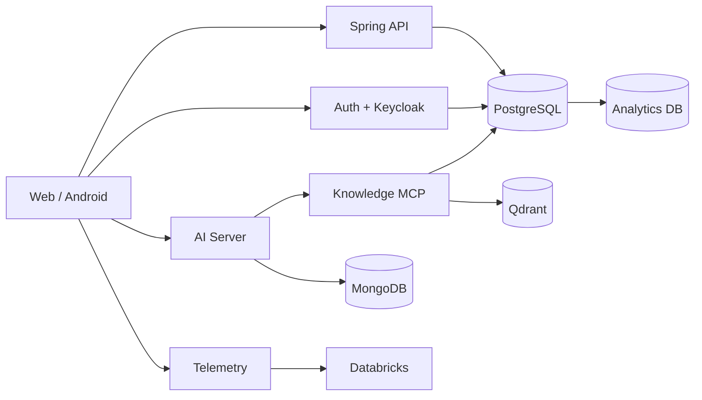

# Ouros Docs

Referência técnica central da plataforma Ouros.

Este portal foi montado a partir do estado real dos repositórios da organização, incluindo código, configuração, migrations, workflows e READMEs.

!!! note "Regra simples"
    O README de cada repo explica **como aquele repo funciona**. Esta wiki explica **como o Ouros funciona como sistema**.

## Comece por aqui

-   :material-rocket-launch:{ .lg .middle } **Primeiros passos**

    ---

    Descubra qual repo usar, como rodar localmente e como navegar pelos ambientes.

    [:octicons-arrow-right-24: Começando](getting-started/index.md)

-   :material-sitemap:{ .lg .middle } **Arquitetura**

    ---

    Serviços, identidade, bancos, IA e fluxo de dados.

    [:octicons-arrow-right-24: Arquitetura](architecture/index.md)

-   :material-source-repository-multiple:{ .lg .middle } **26 repositórios**

    ---

    Catálogo técnico da organização inteira, com uma página para cada repo.

    [:octicons-arrow-right-24: Catálogo](repositories/index.md)

-   :material-api:{ .lg .middle } **APIs**

    ---

    Qual serviço chamar, autenticação e principais contratos.

    [:octicons-arrow-right-24: APIs](apis/index.md)

-   :material-database:{ .lg .middle } **Dados**

    ---

    PostgreSQL prod/QA, analytics, MongoDB e modelo de domínio.

    [:octicons-arrow-right-24: Bancos de dados](databases/index.md)

-   :material-shield-lock:{ .lg .middle } **Segurança**

    ---

    Keycloak, JWT, secrets, permissões e isolamento de dados.

    [:octicons-arrow-right-24: Segurança](security/index.md)

-   :material-tools:{ .lg .middle } **Operações**

    ---

    Ambientes, secrets e troubleshooting de problemas reais.

    [:octicons-arrow-right-24: Operações](operations/environments.md)

-   :material-code-braces:{ .lg .middle } **Desenvolvimento**

    ---

    PRs, migrations, templates e manutenção da própria documentação.

    [:octicons-arrow-right-24: Desenvolvimento](development/index.md)

## Estado documentado

Snapshot técnico analisado em **18 de setembro de 2026**.

A documentação registra também divergências importantes entre intenção e implementação, por exemplo:

- READMEs que ficaram para trás do código;
- clientes ainda em estado de scaffold;
- componentes em migração de autenticação;
- infraestrutura experimental;
- diferenças deliberadas entre QA e produção.

!!! warning "Docs não substituem o código"
    Quando comportamento executável e texto divergirem, confirme no código/configuração atual e atualize esta wiki.

## Arquitetura em uma tela

## Encontrou algo desatualizado?

Atualize a documentação na mesma PR que altera o comportamento, sempre que possível. O portal usa `mkdocs build --strict` no CI para evitar navegação e referências quebradas.
