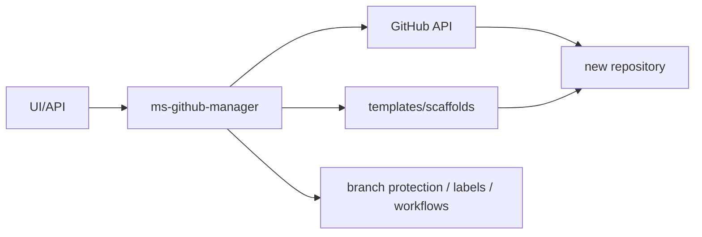

# ms-github-manager

**Stack:** Python, FastAPI, PyGithub, HTML/JS estático, Prometheus.

**Repo:** [Ouros-App/ms-github-manager](https://github.com/Ouros-App/ms-github-manager)

## Responsabilidade

Automatiza criação e padronização de repositórios na organização.

Ele é um “bootstrapper” de engenharia:

## API

### Auth

| Método | Rota |
| --- | --- |
| POST | `/auth/login` |
| GET | `/auth/session` |
| POST | `/auth/logout` |

A sessão usa cookie:

- HTTP-only;
- `SameSite=Lax`;
- `Secure` configurável;
- TTL configurável.

Há rate limit local de login.

### Meta/UI

- `GET /`;
- `GET /health`;
- `GET /ui`;
- `GET /app` redireciona para `/ui`;
- `GET /metrics` com token quando configurado.

### Templates

`GET /templates` lista repositórios cujo nome termina no `TEMPLATE_SUFFIX` e que estão acessíveis via organização.

### Criar repo cru

`POST /repositories/bare`.

Linguagens/modos suportados pelo schema/manager incluem:

- generic;
- frontend;
- springboot;
- fastapi;
- android;
- postgres.

### Criar a partir de template

`POST /repositories/from-template`.

O template precisa existir e estar marcado como template no GitHub.

O manager reconhece famílias por nome/keywords, incluindo MongoDB e PostgreSQL.

### Status

`GET /repositories/creations/{creation_id}`.

Estados:

- `queued`;
- `running`;
- `done`;
- `failed`.

!!! warning
    O estado de criação fica em memória. Reiniciar o processo perde o histórico das criações em andamento/concluídas.

## Fluxo de criação

Para um repo típico:

1. cria/genera repo;
2. espera `main`;
3. aplica scaffold específico;
4. injeta workflow;
5. copia templates de PR;
6. cria label `rerun-ci`;
7. configura branch protection;
8. em alguns tipos, cria/configura integração Sonar;
9. marca criação como concluída.

## Templates de workflow

`app/templates/workflows/` contém:

- `android.yml`;
- `fastapi.yml`;
- `frontend.yml`;
- `generic.yml`;
- `mongodb.yml`;
- `postgres.yml`;
- `springboot.yml`.

## Configuração

Principais variáveis:

- `GH_TOKEN` ou `GITHUB_TOKEN`;
- `GITHUB_ORG_LOGIN`, padrão `Ouros-App`;
- `TEMPLATE_SUFFIX`;
- `DEFAULT_BRANCH`;
- `GH_TIMEOUT_SECONDS`;
- credenciais da UI;
- `SESSION_SECRET`;
- `METRICS_TOKEN`;
- integração Sonar legado.

## Divergência de padrão atual

!!! warning "Automação precisa acompanhar a política da org"
    O manager ainda contém lógica para adicionar SonarCloud em alguns scaffolds. O `ouros-docs` já adotou CI + CodeQL sem Sonar. Portanto, não assuma que o padrão gerado pelo manager representa automaticamente a política mais recente para todos os tipos de repo.

Quando a governança mudar, atualize este serviço e os templates, senão novos repos nascem com padrão antigo.

## Segurança

O token GitHub usado pelo manager tem grande impacto potencial, porque o serviço cria repos, escreve workflows, secrets e proteção de branch.

Boas práticas:

- menor privilégio possível;
- segredo apenas em runtime;
- UI protegida;
- cookie secure em HTTPS;
- logs sem credenciais;
- auditar operações de criação.

## Testes

Há testes para:

- API;
- schemas;
- manager;
- geração/scaffolds.

## Limitações

- estado assíncrono em memória;
- fortemente acoplado às convenções da org;
- alterações no GitHub podem ter efeito amplo;
- templates precisam evoluir junto com os projetos reais.
