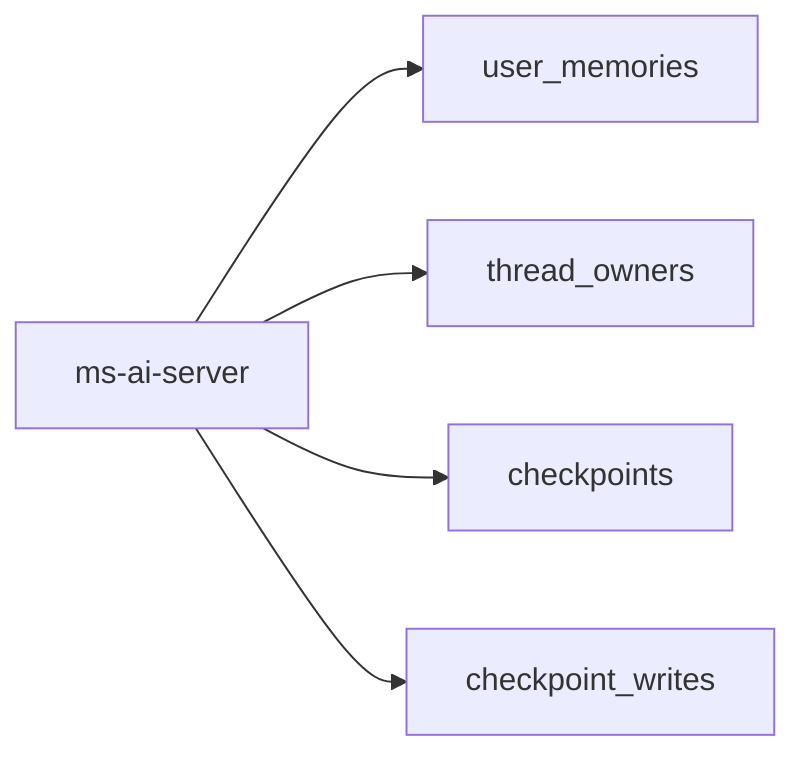

# mongodb-ai-prod-database

**Stack:** MongoDB, Python executor, GitHub Actions.

**Repo:** [Ouros-App/mongodb-ai-prod-database](https://github.com/Ouros-App/mongodb-ai-prod-database)

## Responsabilidade

Versiona a estrutura MongoDB usada pelo `ms-ai-server` em produção.

Banco configurado: `mongodb-ai-prod`.

## Script gerenciado

`mongo/colecoes.json` roda em:

```yaml
mode: on_change
transactional: false
idempotent: true
```

Ele cria/garante índices. A operação é explicitamente não transacional, por isso precisa ser idempotente.

## Coleções e índices

### `user_memories`

Índice único:

```text
(user_id ASC, memory ASC)
```

Impede duplicação exata da mesma memória para o mesmo usuário.

Índice adicional:

```text
(user_id ASC, updated_at DESC)
```

Otimiza recuperação temporal das memórias.

### `thread_owners`

Índice único por `thread_id`.

Garante que uma thread tenha um único owner lógico.

### `checkpoints`

Índice único:

```text
thread_id + checkpoint_ns + checkpoint_id DESC
```

Suporta persistência do checkpointer LangGraph.

### `checkpoint_writes`

Índice único:

```text
thread_id + checkpoint_ns + checkpoint_id + task_id + idx
```

Suporta writes associados aos checkpoints/tarefas.

## Relação com AI Server



O repositório de banco é dono dos índices. Mudanças estruturais não devem ser escondidas dentro do startup do `ms-ai-server`.

## Segurança de índice único

Antes de aplicar índices unique, o executor verifica conflitos existentes. Se houver dados duplicados incompatíveis, a migration falha em vez de escolher/apagar registros automaticamente.

## Versionamento

Coleções internas:

- `controle_scripts_mongo`: checksum/progresso;
- `controle_contadores`: geração de versão;
- `controle_versoes`: histórico por commit.

## Configuração

- `MONGODB_URI`;
- `MONGODB_TLS`;
- `MONGODB_TLS_CA_FILE`.

Em CI de aplicação, TLS é forçado e a CA é fornecida por secret quando necessária.

## Execução

```bash
cp .env.example .env
python -m pip install -r requirements.txt
python scripts/apply_mongo.py
```

## Modos

`always`, `on_change`, `once`, `never`.

Entradas transacionais são preferíveis quando suportadas. Entradas não transacionais precisam declarar idempotência.

## Testes

A suíte cobre config/expansão de ambiente e retomada após falha de script não transacional.
