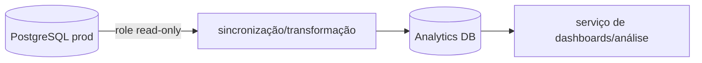

# ouros-analytics-database

**Stack:** PostgreSQL versionado pelo mesmo executor-base dos bancos Ouros.

**Repo:** [Ouros-App/ouros-analytics-database](https://github.com/Ouros-App/ouros-analytics-database)

## Estado atual

!!! warning "Bootstrap"
    O repositório ainda está estruturalmente no começo. No snapshot atual, `config.yaml` possui `execution_order: []`. Portanto, ainda não existe no Git uma camada materializada de joins, anonimização e tabelas analíticas de negócio.

O que já existe:

- executor PostgreSQL;
- tabela de versionamento;
- configuração de conexão;
- CI/Apply SQL base;
- scaffold para receber migrations analíticas.

## Objetivo arquitetural

O banco deve transformar dados operacionais em estruturas voltadas para análise, evitando que dashboards executem joins pesados e lógica de limpeza diretamente em produção.

Fluxo desejado:



## Separação de responsabilidades

**Produção**:

- normalização transacional;
- integridade de negócio;
- escrita das APIs.

**Analytics**:

- joins prontos;
- dados limpos;
- anonimização/pseudonimização quando aplicável;
- índices de leitura;
- agregações;
- tabelas ou views próprias para dashboards.

## Contrato de origem

O repo de produção já contém objetos para sincronização analítica, incluindo:

- timestamps `updated_at` em tabelas selecionadas;
- role read-only de sync.

Isso permite incrementalidade sem dar ao pipeline analítico permissão de escrita em produção.

## Próximos objetos esperados

Sem inventar schema ainda não implementado, categorias naturais para a futura modelagem incluem:

- consumo hídrico por fazenda/período;
- consumo energético por fazenda/período;
- produção/lotes;
- dimensões de fazenda, empresa, região e tempo;
- indicadores derivados.

Essas estruturas só devem ser documentadas como contrato quando existirem no SQL.

## Configuração atual

Mesmo conjunto-base:

```text
POSTGRES_HOST
POSTGRES_PORT
POSTGRES_DB
POSTGRES_USER
POSTGRES_PASSWORD
POSTGRES_ROOT_DB
POSTGRES_ROOT_USER
POSTGRES_ROOT_PASSWORD
```

## Critério para considerar pronto

O banco analítico passa de scaffold para componente funcional quando houver, no mínimo:

1. migrations de schema analítico em `sql/`;
2. `execution_order` explícita;
3. processo definido de sincronização incremental;
4. ownership e retenção documentados;
5. testes com dados representativos;
6. consumidor definido sem depender de acesso de escrita ao prod.

## Regra

Não use o banco analítico como segunda fonte de verdade transacional. Ele é uma projeção derivada.
