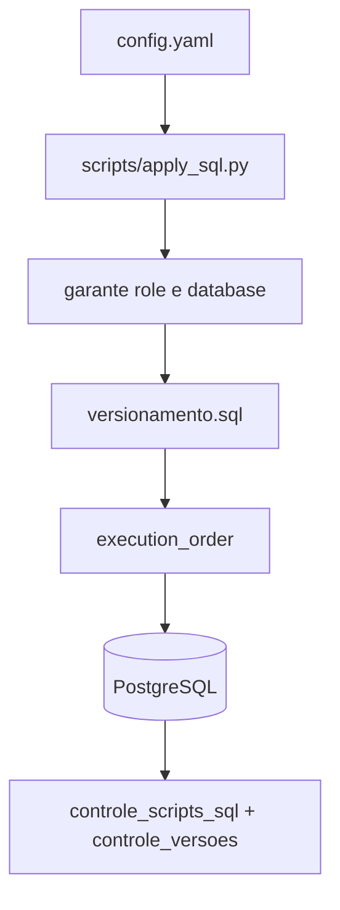

# postgres-segundo-prod-database

**Stack:** PostgreSQL, Python 3.12, psycopg2, YAML, GitHub Actions.

**Repo:** [Ouros-App/postgres-segundo-prod-database](https://github.com/Ouros-App/postgres-segundo-prod-database)

## Responsabilidade

É a fonte de verdade versionada do **contrato PostgreSQL transacional de produção**.

O repositório não provisiona a máquina/serviço PostgreSQL. Ele gerencia:

- database/owner quando permitido pelas credenciais bootstrap;
- schema;
- migrations;
- roles auxiliares;
- views;
- funções;
- seeds controlados;
- histórico de aplicação.

## Fluxo de aplicação



## Ordem gerenciada

Na configuração observada:

1. `banco_ouros_fisico.sql` — `on_change`
2. `atualiza_updated_at_analytics.sql` — `on_change`
3. `analytics_sync_user.sql` — `on_change`
4. `keycloak_user_link.sql` — `on_change`
5. `ms_auth_service.sql` — `on_change`
6. `triggers_logs.sql` — `on_change`
7. `atualiza_lots_farm-owners.sql` — `once`
8. `atualiza_farms-chicken-left.sql` — `once`
9. `dataload_inicial.sql` — `once`, com baseline defensivo
10. `atualiza_consumo_mensal.sql` — `never`
11. `views_galinhas_consumo.sql` — `on_change`
12. `dataload_lots_farm-owners.sql` — `never`
13. `atualiza_password.sql` — `once`
14. `midas-user.sql` — `on_change`
15. `midas-resource-import.sql` — `on_change`

## Proteção de dados

`dataload_inicial.sql` possui `baseline_query`. Se já houver qualquer dado de aplicação em tabelas centrais, o runner registra o script como baseline em vez de injetar/reescrever dados sintéticos.

Isso evita um dos riscos mais perigosos de versionamento de banco: tratar seed inicial como estado desejado eterno.

Scripts marcados `never` continuam no histórico, mas não rodam automaticamente.

## Versionamento

### `controle_scripts_sql`

Rastreia cada arquivo, checksum, commit e horário de execução. É a base para `on_change` e `once`.

### `controle_versoes`

Registra versões aplicadas do conjunto do banco.

## Analytics

O repo também prepara integração analítica:

- `updated_at` em tabelas relevantes;
- role de sincronização read-only;
- grants limitados para leitura das tabelas úteis.

A transformação final deve ocorrer no banco analítico, não no banco transacional.

## Identidade

Migrations recentes integram o schema legado ao novo fluxo:

- vínculo Keycloak;
- role/contrato para `ms-auth-service`;
- usuário read-only do Midas;
- função controlada de importação de recursos.

## Variáveis

```text
POSTGRES_HOST
POSTGRES_PORT
POSTGRES_DB
POSTGRES_USER
POSTGRES_PASSWORD
POSTGRES_ROOT_DB
POSTGRES_ROOT_USER
POSTGRES_ROOT_PASSWORD
```

Outras migrations podem exigir secrets específicos, por exemplo passwords de roles auxiliares, que devem viver fora do Git.

## Execução local

```bash
cp .env.example .env
python -m pip install -r requirements.txt
python scripts/apply_sql.py
```

## CI/CD

O repo possui:

- validação estrutural;
- testes do executor;
- integração com PostgreSQL real;
- bloqueios contra operações destrutivas automáticas;
- workflow que aplica SQL após push na `main`.

## Relação com APIs

- `ms-spring-api`: leitura/escrita do domínio;
- `ms-auth-service`: leitura de identidades;
- Knowledge MCP: leitura contextual e importação via função dedicada;
- analytics: leitura limitada para replicação/transformação.

## Cuidados

!!! danger
    Nunca trate uma alteração em `banco_ouros_fisico.sql` como migration livre de efeitos só porque ela está em `on_change`. Tudo que reexecuta precisa ser idempotente e seguro para dados existentes.

Para mudança de dados já existentes, prefira arquivo `once` dedicado e imutável.
