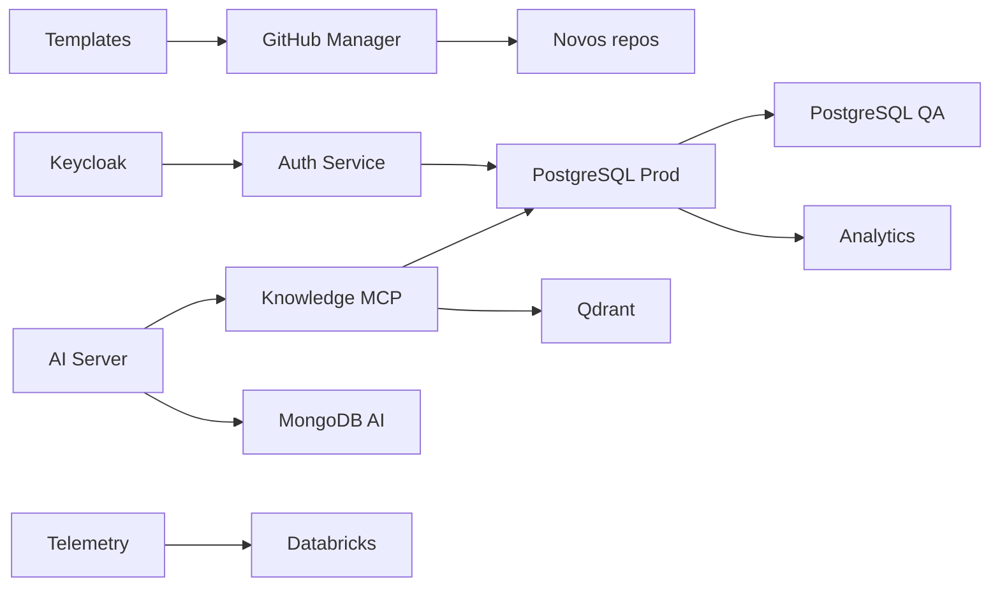

# Catálogo de repositórios

A organização `Ouros-App` possui **26 repositórios** no snapshot de 19/09/2026.

Esta página funciona como índice técnico. **Estado observado** descreve o que existe na `main` analisada, não a importância do projeto nem uma nota de qualidade.

## Serviços centrais

| Repositório | Stack principal | Estado observado | Papel |
| --- | --- | --- | --- |
| `ms-spring-api` | Java 17, Spring Boot 3.4, JPA, PostgreSQL | funcional / legado de auth em transição | API transacional do domínio Ouros. |
| `ms-auth-service` | Python 3.12, FastAPI, PostgreSQL, Redis | funcional / integração Keycloak ativa | Credenciais legadas e bridge de identidade. |
| `ouros-keycloak` | Keycloak 26.7.3, Java SPI, PostgreSQL | funcional / infraestrutura central | IdP OIDC, clients-as-code e User Storage federado. |
| `ms-ai-server` | FastAPI, LangGraph, MongoDB, Groq/NIM | funcional | Backend conversacional do Midas. |
| `ms-mcp-server-ouros-knowledge` | FastMCP, Qdrant, PostgreSQL, NVIDIA | funcional / contrato local com drift de README | Conhecimento, contexto MIDAS e importação controlada. |
| `ms-mcp-server-ouros-knowledge-codemode` | FastMCP, Qdrant, PostgreSQL | experimental | Fork para testar arquitetura Code Mode. |
| `ms-telemetry-dashboard-service` | FastAPI, Databricks, Chart.js | funcional / auth ainda por Bearer estático | Dashboards e renderização de gráficos. |

## Dados

| Repositório | Stack | Estado observado | Papel |
| --- | --- | --- | --- |
| `postgres-segundo-prod-database` | PostgreSQL, Python runner | funcional / fonte de verdade | Schema e migrations do OLTP de produção. |
| `postgres-segundo-qa-database` | PostgreSQL, reconciliador Python | funcional | QA reconciliado a partir do contrato de prod. |
| `ouros-analytics-database` | PostgreSQL, Python runner | bootstrap | Banco analítico; ainda sem migrations de domínio na ordem de execução. |
| `mongodb-ai-prod-database` | MongoDB, Python runner | funcional | Índices/estrutura da persistência de IA em prod. |
| `mongodb-ai-qa-database` | MongoDB, Python runner | funcional | Contrato equivalente para QA. |

## Clientes e aplicações

| Repositório | Stack | Estado observado | Papel |
| --- | --- | --- | --- |
| `ms-ouros-front-web` | React 19, TypeScript, Vite, Tailwind | scaffold avançado / integração pendente | Cliente web. |
| `ouros-android-app` | Kotlin, XML, ViewBinding | scaffold / integração pendente | Cliente Android. |
| `ouros-crud-primeiro` | não inferido da `main` atual | documentação mínima | CRUD educacional do primeiro ano. |

## Automação e plataforma

| Repositório | Stack | Estado observado | Papel |
| --- | --- | --- | --- |
| `ms-github-manager` | FastAPI, PyGithub | funcional | Criação e padronização de repositórios. |
| `ouros-autoreview-app` | Node 22, TypeScript, Octokit | funcional | GitHub App acionado por `/auto-review`. |
| `ms-discord-bot` | Python, discord.py, Tuya | funcional / observabilidade simples | Console remoto do homelab. |
| `.github` | Markdown + Actions | funcional / metadata pública parcialmente automatizada | Perfil e metadados da organização. |
| `ouros-docs` | MkDocs Material, GitHub Pages | funcional | Este portal técnico. |

## Templates

| Repositório | Stack | Estado observado | Papel |
| --- | --- | --- | --- |
| `ms-fastapi-template` | Python 3.12, FastAPI | scaffold / Dockerfile precisa correção | Base FastAPI. |
| `ms-spring-template` | Java 21, Spring Boot 3.4 | scaffold | Base Spring Boot. |
| `ms-webfront-template` | React 19, TypeScript, Vite | scaffold | Base SPA web. |
| `mobile-template` | Kotlin, XML | scaffold parametrizado | Base Android. |
| `postgres-database-template` | PostgreSQL, Python | funcional como template/executor | Versionamento SQL. |
| `mongodb-database-template` | MongoDB, Python | funcional como template/executor | Versionamento MongoDB. |

## Relações importantes

## Como usar o catálogo

Se você quer...

- **alterar regra de negócio:** comece em `ms-spring-api`;
- **alterar login/token:** veja `ouros-keycloak` e `ms-auth-service`;
- **alterar schema:** vá ao repo de banco, não à API;
- **alterar Midas:** veja `ms-ai-server` e, se envolver dados/tools, o Knowledge MCP;
- **alterar dashboard Databricks:** `ms-telemetry-dashboard-service`;
- **alterar geração de repos:** `ms-github-manager` + template correspondente;
- **alterar política de auto-review:** `ouros-autoreview-app`;
- **alterar esta documentação:** `ouros-docs`.

Veja também:

- [Dependências entre repositórios](../architecture/dependencies.md);
- [Impacto de mudanças](../operations/change-impact.md);
- [Lacunas atuais](../architecture/current-gaps.md).

!!! note
    Nome de repo não prova maturidade. Um repo chamado `prod`, `app` ou `analytics` pode conter infraestrutura pronta e funcionalidade ainda em implantação. Esta documentação diferencia essas coisas explicitamente.
