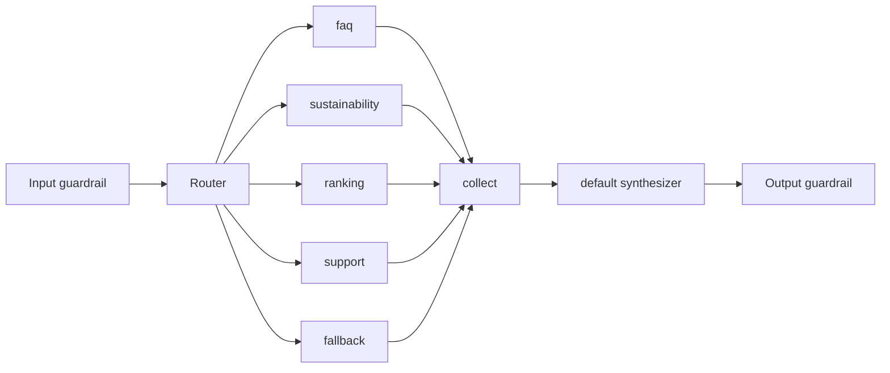

# ms-ai-server

**Stack:** Python 3.12, FastAPI, LangGraph/LangChain, MongoDB, Groq, NVIDIA NIM, MCP.

**Repo:** [Ouros-App/ms-ai-server](https://github.com/Ouros-App/ms-ai-server)

## Responsabilidade

Backend do Midas. Recebe uma mensagem, autentica o usuário, roteia intenções para especialistas, permite uso controlado de memória/MCP e produz uma resposta final sintetizada.

## API

| Método | Rota | Autenticação |
| --- | --- | --- |
| GET | `/` | JWT Keycloak |
| GET | `/health` | JWT Keycloak |
| GET | `/metrics` | JWT Keycloak |
| POST | `/v1/chat` | JWT Keycloak |
| GET | `/v1/chat/{thread_id}/history` | JWT Keycloak |

Swagger/ReDoc/OpenAPI permanecem públicos.

### Chat

Payload:

```json
{
  "message": "Como está meu consumo de energia?",
  "thread_id": "opcional"
}
```

`user_id` ainda pode ser enviado por compatibilidade, mas deve coincidir com o `database_id` assinado no JWT. O backend deriva a identidade do token.

Limites do schema:

- `user_id`: opcional, 1..128 chars e precisa coincidir com o JWT;
- `message`: 1..8000;
- `thread_id`: 1..128; UUID automático quando omitido.

Resposta:

- `thread_id`;
- `message`;
- `agents`;
- `tools`.

## Grafo de agentes



O router pode selecionar até quatro especialistas.

Há roteamento determinístico por palavras-chave antes de recorrer a um LLM, reduzindo custo/latência para intenções óbvias.

## Contrato dos especialistas

Especialistas devem retornar JSON estruturado com:

- `status`;
- `facts`;
- `recommendations`;
- `missing_data`;
- `sources`.

O `default` recebe esses resultados como **dados, não instruções**, e produz a única resposta natural final.

## Models

Perfis rápidos são usados por router, guardrails e especialistas leves. Ranking/sustentabilidade podem usar perfil mais potente.

Groq é o caminho primário conforme disponibilidade; NVIDIA NIM atua como fallback do perfil.

## Memória

Tools injetadas pelo backend:

- `recall_user_memories`;
- `save_user_memory`.

O `user_id` não é fornecido pelo modelo à tool; ele é fechado no backend.

Memórias passam por validação para evitar credenciais e conteúdo inadequado.

## MCP

Allowlist por agente:

| Agente | Tools |
| --- | --- |
| faq | `search_knowledge`, `get_user_context` |
| sustainability | `search_knowledge`, `get_user_context`, `get_user_farm_data` |
| ranking | `get_user_context`, `get_user_farm_data`, `postgres_status` |
| support | `search_knowledge`, `get_user_context` |
| fallback | `search_knowledge` |

Tools de usuário têm identidade vinculada pelo backend. O modelo não escolhe `user_id`.

O provider também filtra `farm_id` contra a lista autorizada retornada pelo contexto do usuário.

## Persistência

MongoDB armazena:

- memórias;
- ownership de threads;
- checkpoints;
- checkpoint writes.

O schema/indexação é gerenciado pelos repositórios `mongodb-ai-*-database`.

## Configuração

Grupos principais:

- MongoDB: `MONGODB_URI`, `MONGODB_DATABASE`;
- Groq: keys e modelos fast/powerful;
- NIM: key, modelos, base URL;
- auth: issuer Keycloak, audience `ms-ai-server` e JWKS;
- MCP: URL/resource e Standard Token Exchange v2 para gerar um JWT delegado ao Knowledge MCP;
- timeouts/temperatura.

## Identidade

O único credential de usuário aceito é um access token Keycloak RS256. O AI Server valida issuer, JWKS, audience `ms-ai-server`, `sub`, `database_id`, `account_type` e a realm role correspondente.

Se `user_id` vier no payload/query por compatibilidade, ele só é aceito quando coincide com o `database_id` assinado. Threads também possuem owner persistido e não podem trocar de usuário posteriormente.

### Interop com Knowledge MCP

O AI Server mantém o access token validado em contexto por request, mas **não** o encaminha diretamente ao Knowledge MCP.

Antes de abrir a conexão MCP, o backend autentica o client confidencial `ms-ai-server-mcp-exchange` no token endpoint do Keycloak e executa Standard Token Exchange v2. O token recebido do mobile precisa conter:

```text
aud=ms-ai-server
aud=ms-ai-server-mcp-exchange
```

O token delegado resultante precisa conter:

```text
aud=ms-mcp-server-ouros-knowledge
azp=ms-ai-server-mcp-exchange
```

O Knowledge MCP aceita apenas esse token delegado. Não existe fallback para encaminhar o JWT mobile diretamente.

## Observabilidade

`/metrics` cobre HTTP, latência, resultado de chat, agentes e tools.

## Testes

Há testes para API, grafo, guardrails, prompts, modelos, MCP, ownership, tools, métricas, config e Infisical.
