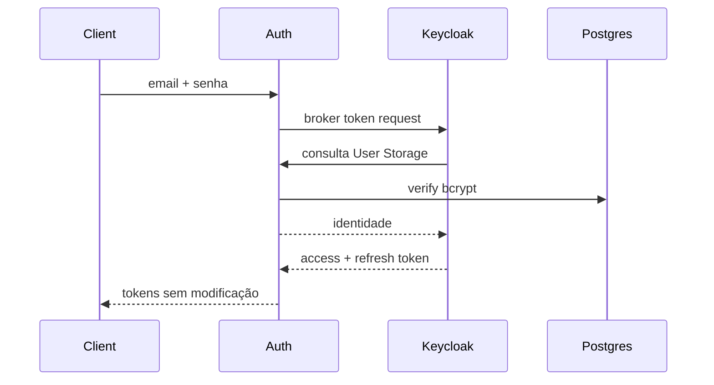

# ms-auth-service

**Stack:** Python 3.12, FastAPI, PostgreSQL, Redis opcional, bcrypt, Keycloak/JWKS.

**Repo:** [Ouros-App/ms-auth-service](https://github.com/Ouros-App/ms-auth-service)

## Responsabilidade

Centraliza a verificação de credenciais legadas e funciona como bridge para o User Storage do Keycloak. Também oferece o contrato oficial de login que devolve tokens **emitidos pelo Keycloak**.

!!! important
    Este serviço não assina JWTs. O Keycloak continua sendo o único issuer dos novos access/refresh tokens.

## Identidades suportadas

| Tipo | Tabela legado | Role Keycloak |
| --- | --- | --- |
| `farm_owner` | `farm_owners` | `farm_owner` |
| `company_employee` | `company_employees` | `company_employee` |
| `admin` | `adms` | `admin` |

## Fluxo público

### `GET /health`

Liveness. Não depende de PostgreSQL ou Redis.

### `GET /ready`

Só responde pronto quando:

- PostgreSQL responde;
- Redis responde quando `REDIS_URL` está configurado.

### `POST /v1/auth/credentials/verify`

Payload:

```json
{
  "email": "user@example.com",
  "password": "senha",
  "account_type": "farm_owner"
}
```

`account_type` é opcional. Sem ele, o serviço procura candidatos nas tabelas suportadas. Ambiguidade pode gerar `409`.

Sucesso retorna a identidade normalizada, incluindo `id`, `account_type`, role e vínculos de negócio.

### `POST /v1/auth/token`

Contrato de login first-party.



## Rotas internas

Prefixo `/internal/v1`. Não aparecem no schema OpenAPI público.

| Método | Rota | Uso |
| --- | --- | --- |
| GET | `/internal/v1/identities/by-email?email=...` | Lookup usado pelo User Storage. |
| GET | `/internal/v1/identities/{account_type}/{database_id}` | Resolve federated identity. |
| POST | `/internal/v1/credentials/verify` | Validação de senha para Keycloak. |

Essas rotas exigem service JWT do client `keycloak-user-storage`, com issuer, audience e `azp` esperados.

## Rate limiting

Defaults:

```text
IP:     3 / 10 s
IP:     5 / min
IP:    20 / 15 min
email:  5 / 15 min
```

Com Redis, limites são compartilhados entre réplicas. Sem Redis, há fallback in-process.

## Segurança

- passwords chegam como `SecretStr`;
- hashes bcrypt nunca saem da camada de serviço;
- tentativa com usuário inexistente ainda executa comparação bcrypt para reduzir timing trivial;
- conexão de banco é configurada read-only;
- produção deve usar role PostgreSQL com apenas `SELECT`;
- rate-limit acontece antes da verificação pesada;
- tokens internos são validados localmente por JWKS.

## Configuração

Principais variáveis:

- `DATABASE_URL`;
- `REDIS_URL`;
- pool: `DATABASE_MIN_POOL_SIZE`, `DATABASE_MAX_POOL_SIZE`;
- rate limits `AUTH_RATE_LIMIT_*`;
- `KEYCLOAK_ISSUER_URL`;
- `KEYCLOAK_INTERNAL_AUDIENCE=ms-auth-service-internal`;
- `KEYCLOAK_INTERNAL_CLIENT_ID=keycloak-user-storage`;
- broker: `KEYCLOAK_TOKEN_BROKER_CLIENT_ID`, secret e scope.

Secrets de produção podem ser carregados do Infisical via Universal Auth.

## Falhas importantes

- `401`: credencial pública inválida;
- `403` na rota interna de credencial: senha inválida, reservando `401` para falha de service token;
- `429`: rate limit;
- `503`: readiness falhou.

## Testes

A suíte cobre API pública, timing de usuário inexistente, ambiguidades, bcrypt, rate limiting, banco, Infisical, broker, rotas internas e validação completa do service JWT.
