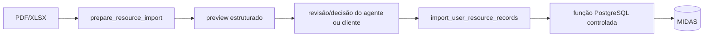

# ms-mcp-server-ouros-knowledge

**Stack:** Python, FastAPI, FastMCP, Qdrant, NVIDIA embeddings/NIM, PostgreSQL.

**Repo:** [Ouros-App/ms-mcp-server-ouros-knowledge](https://github.com/Ouros-App/ms-mcp-server-ouros-knowledge)

!!! warning "README local e assinatura atual divergem"
    O README do repo descreve parâmetros adicionais de identidade/confirmação em algumas tools de importação. No `app/mcp_server.py` da `main` analisada, `prepare_resource_import` recebe apenas `filename`, `content_type` e `encoded_file`, enquanto `import_user_resource_records` não expõe um parâmetro `confirmation`. Esta página documenta a assinatura executável atual.

## Responsabilidade

Servidor MCP que une três funções:

1. conhecimento semântico em Qdrant;
2. leitura contextual do banco MIDAS;
3. importação controlada de registros históricos de água/energia.

O transporte MCP usa Streamable HTTP em `/mcp/`.

## Endpoints REST

- `GET /`: disponibilidade;
- `GET /health`: liveness;
- `/docs`, `/redoc`, `/openapi.json`: documentação FastAPI.

As operações de negócio ficam nas MCP tools.

## Tools MCP

### `search_knowledge(query, limit)`

Gera embedding NVIDIA e busca na coleção Qdrant.

Regras:

- query não pode ser vazia;
- `limit` entre 1 e 20.

### `qdrant_status()`

Diagnóstico da coleção configurada.

### `postgres_status()`

Diagnóstico da conexão read-only com PostgreSQL MIDAS.

### `get_user_context(user_type, user_id)`

Carrega perfil e farms vinculadas, após validar a identidade autenticada.

Tipos:

- `farm_owner`;
- `company_employee`;
- `admin`.

### `get_user_farm_data(user_type, user_id, limit=20)`

Retorna dados bounded da(s) fazenda(s) autorizada(s), com limite de 1 a 100 por grupo.

### `prepare_resource_import(filename, content_type, encoded_file)`

Converte PDF/XLSX em Markdown e usa NIM para extrair um **preview** de registros. Não grava no banco.

### `import_user_resource_records(...)`

Grava os registros por função controlada do PostgreSQL. Atualmente o código só permite importação para `farm_owner`.

## Segurança

O design evita SQL arbitrário. As queries são fixas e a escrita de importação passa por função dedicada no banco.

Separação de credenciais:

- `MIDAS_DATABASE_URL`: leitura;
- `MIDAS_IMPORT_DATABASE_URL`: role de importação com `EXECUTE` controlado.

O transporte MCP usa Bearer configurado em `MCP_AUTH_TOKEN`.

## Qdrant

Configuração:

- `QDRANT_URL`;
- `QDRANT_API_KEY`;
- `QDRANT_COLLECTION_NAME`;
- `NVIDIA_EMBEDDING_MODEL`;
- `SEARCH_TOP_K`.

O modelo de embedding usado na busca deve ser compatível com o usado na ingestão.

## Ingestão documental

O repo inclui CLI e manifesto de ingestão para evitar reprocessamento desnecessário. A sincronização considera hash do arquivo, modelo, coleção e parâmetros de chunking.

## Importação de dados do usuário

Fluxo seguro:

`prepare_resource_import` nunca escreve. Isso separa interpretação por IA de mutação real.

## Configuração relevante

- `APP_PORT`, `APP_NAME`;
- Qdrant;
- NVIDIA embeddings/NIM;
- `MIDAS_DATABASE_URL`;
- `MIDAS_IMPORT_DATABASE_URL`;
- `MCP_AUTH_TOKEN`;
- `MCP_RESOURCE_URL`.

## Testes

A suíte cobre autenticação, CLI, banco, importação, Infisical, knowledge e transporte MCP.
