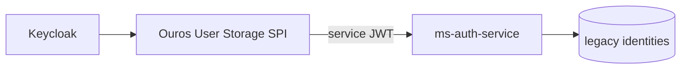

# ouros-keycloak

**Stack:** Keycloak 26.7.3, PostgreSQL, Bash IaC, Java 21 User Storage SPI.

**Repo:** [Ouros-App/ouros-keycloak](https://github.com/Ouros-App/ouros-keycloak)

## Responsabilidade

Infraestrutura central de identidade do Ouros:

- realm `ouros`;
- emissão de access/refresh tokens;
- roles;
- clients-as-code;
- scopes/audiences;
- User Storage federado;
- integração com `ms-auth-service`;
- reconciliação idempotente no startup.

## Endpoints públicos

Issuer:

```text
https://ouros-keycloak.discloud.app/realms/ouros
```

Discovery:

```text
https://ouros-keycloak.discloud.app/realms/ouros/.well-known/openid-configuration
```

JWKS:

```text
https://ouros-keycloak.discloud.app/realms/ouros/protocol/openid-connect/certs
```

Resource servers devem validar assinatura, `iss`, `exp` e `aud`.

## Clients as Code

Arquivos em `iac/resources/*.conf` são reconciliados no startup.

Resources relevantes ao caminho atual:

```text
ouros-mobile
keycloak-user-storage
ms-auth-service-broker
ms-auth-service-internal
ms-spring-api
ms-ai-server
ms-ai-server-debug
ms-mcp-server-ouros-knowledge
ms-mcp-server-ouros-knowledge-codemode
ms-telemetry-dashboard-service
```

O `ouros-mobile` é public client com PKCE e recebe audiences para Spring, AI Server, Telemetry e para a delegação interna do Knowledge MCP. O `ms-auth-service-broker` permanece como compatibilidade legada.

### `microservice`

Resource server. Não possui login interativo. Gera audience scope e mapper.

### `mobile`

Public client com Authorization Code + PKCE S256.

### `web`

Public client com Authorization Code + PKCE S256, redirect URIs e web origins explícitos.

### `service`

Confidential client com service account e Client Credentials.

### `password-grant`

Exceção confidencial e explicitamente isolada para ferramentas internas. O caso atual é `ms-ai-server-debug`; não é contrato de mobile/web.

## Claims

O client scope `ouros-identity` é anexado a clients de usuário e transporta:

- `database_id`;
- `account_type`;
- `farm_id`;
- `enterprise_id`;
- `first_access`.

Autorização continua em `realm_access.roles`.

## User Storage

O provider Java `providers/ouros-user-storage` implementa federação read-only.



O provider consulta e valida senha via Auth Service. Keycloak não altera a senha legada.

## Reconciliação

Startup:

```text
Keycloak
  ↓
espera Admin API
  ↓
sync-realm.sh
  ↓
sync-clients.sh
  ↓
sync-user-storage.sh
```

A reconciliação é idempotente e deliberadamente não destrutiva: remover um `.conf` do Git **não apaga automaticamente** um client existente.

## Segurança

- mobile/web sem client secret;
- service clients com secret gerado no Keycloak;
- Direct Access Grants desativados em mobile/web/resource servers; a exceção de debug é declarada e isolada;
- PKCE S256 obrigatório para clientes públicos;
- PostgreSQL do Keycloak fica em VLAN privada;
- sessão administrativa do reconciliador fica em `/tmp`;
- secrets não pertencem ao Git.

## Variáveis críticas

- `KC_BOOTSTRAP_ADMIN_*`: bootstrap inicial;
- `KC_IAC_ADMIN_*`: automação permanente;
- `KC_RECOVERY_ADMIN_*`: recuperação temporária;
- `KC_HOSTNAME`;
- `KC_DB_URL`, `KC_DB_USERNAME`, `KCRAW_DB_PASSWORD`.

## Adicionando um client

1. copiar exemplo em `iac/examples/`;
2. criar `iac/resources/<client>.conf`;
3. declarar tipo, ID e audiences;
4. rodar `bash iac/validate.sh`;
5. abrir PR;
6. aguardar CI;
7. redeploy para reconciliar.

## Testes

A CI sobe PostgreSQL + Keycloak real e testa:

- tipos de client;
- PKCE;
- service credentials;
- User Storage;
- login federado;
- refresh token;
- claims;
- roles;
- JWKS;
- idempotência;
- testes unitários Java do provider.
