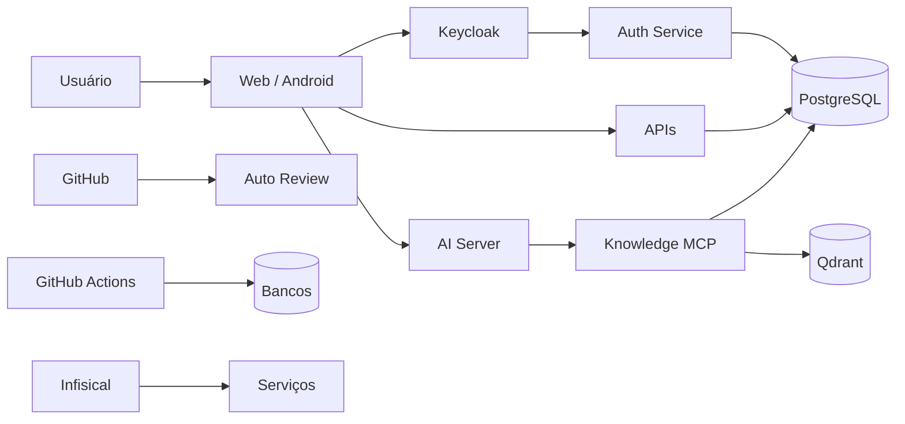

# Threat model

Threat model prático baseado nas fronteiras de confiança observadas no código atual.

## Ativos principais

### Identidade

- passwords legados;
- hashes bcrypt;
- access tokens;
- refresh tokens;
- client secrets;
- service JWTs;
- private keys do GitHub App;
- session secrets.

### Dados pessoais

- nome;
- email;
- documento;
- telefone;
- foto;
- vínculos com fazenda/empresa.

### Dados operacionais

- consumo de água;
- consumo de energia;
- lotes;
- produção;
- perdas;
- custos;
- pagamentos;
- metas.

### Dados de IA

- memórias;
- histórico/thread state;
- documentos importados;
- resultados de busca;
- prompts/respostas.

## Fronteiras de confiança



Cada seta cruza uma fronteira que precisa de autenticação, autorização ou validação.

## Ameaça: brute force de login

Risco:

- tentativa massiva de senha;
- enumeração de usuário;
- custo de bcrypt.

Mitigações observadas:

- rate limit por IP;
- rate limit por email;
- bcrypt mesmo para usuário inexistente;
- Redis opcional para estado compartilhado.

Ponto de atenção:

- proxy mal configurado pode colapsar vários usuários em um único IP aparente.

## Ameaça: token confusion

Risco:

> token válido para um serviço ser aceito por outro.

Mitigações:

- issuer;
- audience;
- assinatura;
- expiração;
- `azp` para integrações internas;
- separar explicitamente tokens estáticos, JWT Keycloak e JWT HS256 locais.

No estado atual, o mesmo header `Authorization: Bearer` transporta credenciais **não intercambiáveis** entre Spring, AI, MCP e Telemetry.

Não valide apenas “JWT parseou” e não reutilize um token em outro serviço só porque o esquema HTTP é Bearer.

Veja [Compatibilidade de tokens](../apis/token-compatibility.md).

## Ameaça: IDOR / troca de identidade

Exemplo:

> usuário pede dados de `farm_id=999` que não pertence a ele.

Mitigações observadas no AI/MCP:

- `user_id` injetado pelo backend;
- farms autorizadas retornadas por contexto;
- `farm_id` comparado com allowlist;
- dados filtrados antes de voltar ao modelo.

O mesmo princípio deve existir em qualquer API de domínio: ID no path não prova ownership.

## Ameaça: prompt injection

Fontes possíveis:

- mensagem do usuário;
- documento ingerido;
- dado textual vindo do banco;
- conteúdo recuperado do Qdrant.

Mitigações observadas:

- especialistas retornam estrutura;
- síntese recebe resultados como dados;
- allowlist de tools por agente;
- guardrails;
- tool identity fora do controle do modelo.

Risco residual:

- conteúdo não confiável ainda chega ao LLM;
- prompt injection nunca deve ser considerado “resolvido” apenas por system prompt.

## Ameaça: SQL arbitrário por IA

Mitigação arquitetural:

- queries fixas;
- roles separadas;
- função controlada para importação;
- preview antes de write.

Evite introduzir uma tool genérica:

```text
execute_sql(sql: string)
```

para agentes de usuário.

## Ameaça: duplicação por retry

Importações usam `request_id UUID`.

Objetivo:

- mesma operação repetida por retry não virar duplicação silenciosa.

Outras mutations críticas deveriam adotar idempotency key quando retry for possível.

## Ameaça: webhook spoofing

Auto Review recebe webhook público.

Mitigação:

- HMAC SHA-256;
- corpo raw;
- comparação timing-safe;
- permission check do autor.

Sem assinatura válida, não executar ação GitHub.

## Ameaça: supply-chain/CI com privilégio

Workflows podem:

- aplicar migrations;
- acessar secrets;
- publicar Pages;
- alterar repos.

Riscos:

- action comprometida;
- permissões excessivas;
- PR manipulando workflow;
- secret exfiltration.

Mitigações recomendadas/observadas:

- permissions explícitas;
- actions versionadas;
- secrets do GitHub;
- revisão de workflows;
- branch protection.

## Ameaça: migration destrutiva

Riscos:

- DROP/TRUNCATE;
- seed sobrescrevendo dados;
- migration `on_change` com side effect;
- QA drift quebrando apply.

Mitigações:

- CI contra DDL destrutivo;
- `once` vs `on_change`;
- baseline de seed;
- dry-run QA;
- quarentena;
- controle por checksum.

## Ameaça: secret no Git

Fontes comuns:

- `.env`;
- README;
- curl;
- screenshot;
- workflow;
- Vite env;
- Dockerfile.

Mitigações:

- Infisical;
- GitHub Secrets;
- `.gitignore`;
- exemplos vazios;
- rotação após exposição.

Lembrete:

`VITE_*` é público.

## Ameaça: XSS

### Frontend

DOMPurify está disponível no template/web.

Ainda assim, preferir não usar HTML não confiável quando não for necessário.

### Telemetry Chart.js

O serviço escapa:

- título HTML;
- caracteres especiais no JSON embutido.

Isso reduz risco ao gerar HTML self-contained.

## Ameaça: vazamento por logs

Dados que nunca devem ser logados:

- password;
- Authorization header;
- refresh token;
- private key;
- documento importado completo;
- connection string com senha.

AI Server declara logging sem conteúdo de mensagem/credencial.

Telemetry usa campos controlados e request ID.

## Ameaça: privilégio excessivo no banco

Estratégias observadas:

- Auth: read-only;
- Midas: `midas_ro`;
- importação: role separada;
- analytics sync: read-only;
- bootstrap separado do owner.

Evite usar root/admin como credencial padrão da aplicação.

## Ameaça: serviço interno exposto publicamente

Rotas internas do Auth não entram no OpenAPI público e exigem service JWT.

Mesmo quando rede não é privada, a rota precisa continuar autenticada.

## Ameaça: dependência externa indisponível

Exemplos:

- Databricks;
- Groq;
- NVIDIA;
- Qdrant;
- Redis.

Mitigações:

- timeout;
- retry limitado;
- readiness;
- fallback quando apropriado;
- erro 502/504 explícito.

Retry não deve duplicar mutation.

## Ameaça: cache/estado cruzando usuário

Itens críticos:

- thread ownership;
- memory key por usuário;
- cache de dashboard privado;
- sessões.

Qualquer cache novo deve incluir a dimensão de autorização correta.

## Lacunas atuais relevantes

- mecanismos de auth ainda mistos;
- Bearer estático em alguns serviços;
- observabilidade não uniforme;
- clientes ainda incompletos;
- Auto Review sem fila persistente;
- bot homelab usa token literal no shutdown.

Veja também [Lacunas atuais](../architecture/current-gaps.md).

## Checklist para feature nova

- [ ] dado é sensível?
- [ ] quem autentica?
- [ ] quem autoriza?
- [ ] ownership validado no backend?
- [ ] DB role mínima?
- [ ] logs sanitizados?
- [ ] timeout?
- [ ] retry idempotente?
- [ ] secret fora do Git?
- [ ] migration preserva dados?
- [ ] IA tem tool mínima?
- [ ] retorno pode vazar dado de outro usuário?
